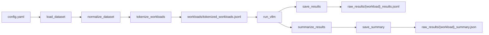

##  001 Workload Analysis

Chat, RAG, Agent workload를 동일한 request schema로 정규화한 뒤, vLLM에 Poisson arrival로 전송해 prompt 길이·KV cache reuse·latency를 측정한다.

### 파이프라인 구조



### 모듈별 역할

- [`scripts/dataset.py`](scripts/dataset.py)
  - `load_dataset()`: ShareGPT·MS MARCO·Terminal-Bench 원본 로드
  - `normalize_dataset()`: 원본 row를 공통 request schema로 변환
- [`scripts/tokenizer.py`](scripts/tokenizer.py)
  - `tokenize_workloads()`: chat template 적용 및 token 길이 계산
  - `save_tokenized_workloads()` / `load_tokenized_workloads()`: JSONL 저장 및 재사용
- [`scripts/vllm_benchmark.py`](scripts/vllm_benchmark.py)
  - `run_vllm()`: workload 선택·Poisson schedule·비동기 요청 실행
  - `save_results()`: 요청별 측정 결과 JSONL 저장
- [`scripts/summary.py`](scripts/summary.py)
  - `summarize_results()`: prompt·cache·latency metric 집계
  - `save_summary()`: workload summary JSON 저장

### 데이터셋 설명

- `chat`: ShareGPT 멀티턴 대화
- `rag`: MS MARCO v2.1 query·retrieved passage
- `agent`: Terminal-Bench tool-use trajectory

### 설정

기본 설정 파일은 [config.yaml](config.yaml)이다.

```yaml
# workload별 정규화 request 설정
workloads:
  - type: chat
    count: 1000          # workload별 request 수
    min_turns: 10        # 최소 대화 turn 수
    max_turns: 10        # 최대 대화 turn 수

  - type: rag
    count: 1000          # workload별 request 수

  - type: agent
    count: 1000          # workload별 request 수
    min_steps: 9         # 최소 tool request step 수
    max_steps: 9         # 최대 tool request step 수
    max_prompt_chars: 24000  # prompt 문자 수 제한

# 데이터 row shuffle 설정
sampling:
  random: true           # workload별 row shuffle 여부
  seed: 42               # shuffle 재현용 seed

# 사전 token 길이 계산용 tokenizer
tokenizer:
  name: meta-llama/Llama-3.2-3B-Instruct

# tokenized workload 저장 경로
output: workloads/tokenized_workloads.jsonl

# vLLM 측정 설정
vllm:
  url: http://127.0.0.1:8000/v1/chat/completions  # vLLM endpoint
  model: meta-llama/Llama-3.2-3B-Instruct       # vLLM server model
  max_tokens: 1                               # 최대 completion token 수
  timeout_seconds: 1800                       # 요청 timeout
  output_dir: raw_results                     # 측정 결과 저장 경로
  schedule:
    type: poisson                            # 요청 도착 분포
    qps: 5.0                                 # 평균 초당 요청 수
    seed: 42                                 # arrival 재현용 seed
    max_concurrency: 32                      # 동시 요청 상한
```

### 실행 방법

#### 0. 의존성 설치

프로젝트 루트에서 의존성을 설치한다.

```bash
pip install -r requirements.txt
```

#### 1. vLLM 서버 실행

vLLM 서버를 먼저 실행한다.

```bash
export VLLM_DIR=/home/ubuntu/vllm
cd "$VLLM_DIR"
source "$VLLM_DIR/.venv/bin/activate"

vllm serve meta-llama/Llama-3.2-3B-Instruct \
  --enable-prefix-caching \
  --enable-prompt-tokens-details \
  --max-model-len 8192 \
  --max-num-seqs 32 \
  --gpu-memory-utilization 0.6 \
  --port 8000
```

#### 2. workload 측정

새 터미널에서 프로젝트 루트로 이동한 뒤, 세 workload를 각각 실행한다.

```bash
cd /home/ubuntu/JJ-distributed-LLM-inference
source /home/ubuntu/JJ-distributed-LLM-inference/.venv/bin/activate

python 001_workload_analysis/runner.py \
  --config 001_workload_analysis/config.yaml \
  --workload chat

python 001_workload_analysis/runner.py --workload rag // config 생략 시 자동으로 지정
python 001_workload_analysis/runner.py --workload agent
```
