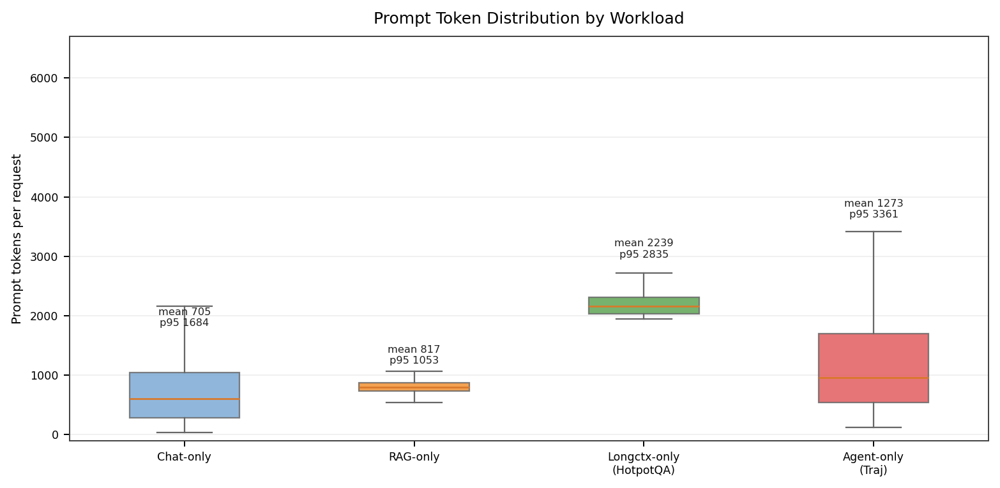

# Graduation Project Progress Report 1

## 기본 정보

| 항목 | 내용 |
|---|---|
| Title | QuotaServe: Mixed LLM Serving에서 Workload-aware Prefix Cache Quota를 통한 Hot Cache 보호 |
| Summary | 본 프로젝트는 mixed LLM serving 환경에서 prefix cache의 이점이 왜 약해지는지 분석하고, 이를 완화하는 QuotaServe 정책을 설계하는 것을 목표로 한다. vLLM automatic prefix caching의 LRU 정책은 재사용 가치보다 최근 접근 시점만 반영하므로, think-gap 이후 다시 사용될 hot prefix block이 재사용 전에 evict될 수 있다. 본 연구는 Chat을 공통 기준 workload로 두고 cold workload인 RAG/Longctx와 warm workload인 Agent를 각각 섞어 이 현상을 확인한다. 현재까지 ShareGPT, MS MARCO, HotpotQA, TerminalBench trajectories 기반 workload를 구성하고, APC ON/OFF 비교, eviction attribution, shadow cache 기반 useful eviction 계측을 수행했다. 현재 분석 결과는 mixed workload에서 Chat의 cache hit rate, TTFT, SLO가 악화되며, cold/warm workload 모두에서 useful eviction이 중요한 신호로 관측됨을 보여준다. |
| Advisor | 추후 기입 |
| Period | 추후 기입 |

## 팀원 정보

| Name | Department | Student ID | Hanyang email | Phone |
|---|---|---|---|---|
| 추후 기입 | 추후 기입 | 추후 기입 | 추후 기입 | 추후 기입 |
| 추후 기입 | 추후 기입 | 추후 기입 | 추후 기입 | 추후 기입 |

## 1. Progress to Date

본 프로젝트의 전체 목표는 mixed LLM serving 환경에서 prefix cache의 성능 저하 원인을 cache policy 관점에서 분석하고, 이를 완화하기 위한 workload-aware cache quota 정책인 QuotaServe를 설계하는 것이다. 현재까지의 진행은 이 목표에 맞추어 문제 가설 수립, 현실적인 workload trace 구성, cache-level 계측 도구 구현, Case 1 실험 분석, QuotaServe 정책 설계 순서로 이루어졌다.

[2026-05-18] 문제 가설을 구체화했다. 하나의 serving system이 Chat, RAG, Agent 등 여러 workload를 동시에 처리할 때 scheduling, batching, prefill/decode interference로 인한 손해가 발생한다. 본 프로젝트는 여기에 더해, vLLM의 LRU 기반 prefix cache에서도 reuse 시간 척도 불일치로 인한 손해가 발생한다고 보았다. 특히 Chat류 workload는 multi-turn 대화 사이의 think-gap 때문에 같은 prefix가 다시 사용되기까지 수 초에서 수십 초의 간격이 생긴다. 본 연구는 Chat을 공통 기준 workload로 두고 cold workload인 RAG/Longctx와 warm workload인 Agent를 각각 섞어, think-gap 또는 tool-calling gap 이후 다시 사용될 hot prefix block이 mixed workload에서 재사용 시점까지 살아남지 못하는지 확인한다. 이 가설은 QuotaServe가 해결하려는 핵심 문제인 cross-workload hot cache eviction을 정의한다.

[2026-06-02] 가설을 검증할 workload trace와 실행 구조를 정리했다. Chat workload는 ShareGPT multi-turn 대화로 만들고, turn-major 순서를 사용해 delayed prefix reuse와 think-gap을 재현했다. RAG workload는 MS MARCO의 retrieved passages를 사용해 실제 retrieval 기반 prompt를 구성했다. 이후 Agent workload는 TerminalBench trajectories를 기반으로 구성하여, tool call과 다음 reasoning step 사이의 tool-calling gap을 재현하는 warm workload 축으로 추가했다. 이 단계에서 single workload와 mixed workload를 같은 실행 구조로 비교할 수 있도록 Case 1 실행 스크립트와 문서를 재정비했다.

[2026-06-03] cache 손해를 직접 관찰하기 위한 계측 방법과 분석 산출물을 정리했다. vLLM 내부에 eviction attribution을 추가하여 어떤 workload가 어떤 workload의 cached prefix block을 evict했는지 기록하도록 했다. 또한 shadow cache를 사용해 evict된 block이 이후 다시 요청되었는지 추적했다. 이 방법을 통해 단순 eviction 수가 아니라, evict되지 않았다면 cache hit으로 이어졌을 useful eviction을 분리하여 측정할 수 있게 되었다. 같은 날짜에 Chat/RAG 조건의 raw summary와 token 분포 시각화도 정리하여, QuotaServe가 보호해야 할 cache block을 실험적으로 정의할 수 있는 기반을 마련했다.

[2026-06-04] Case 1 분석 범위를 Chat+RAG에서 Chat+Longctx와 Chat+Agent 조건으로 확장했다. RAG prompt가 예상보다 짧아 강한 cache pressure를 만들기에는 제한이 있었으므로, HotpotQA distractor 기반 Longctx를 cold workload로 추가했다. 또한 TerminalBench trajectories 기반 Agent를 warm workload로 두어, tool-calling gap 이후 재사용될 수 있는 prefix가 eviction에 얼마나 취약한지 함께 확인했다. 각 조건은 APC ON/OFF로 실행하여 cache-specific gain, hit rate, TTFT, SLO, cross-workload eviction, useful eviction을 비교했다.

[2026-06-06] Case 1 분석을 가설과 더 직접적으로 연결했다. 이 단계에서 LRU의 recency 기반 한계, Chat think-gap, Agent tool-calling gap, eviction 이후 재사용까지의 시간 구조를 분석 문서에 반영했다. 결과적으로 mixed workload에서 Chat의 APC gain과 hit rate가 감소하고, Longctx는 cold workload로서 Chat hot cache에 강한 pressure를 주며, Agent는 warm workload로서 높은 useful eviction ratio를 보인다는 현재 결론을 정리했다. 이 분석은 문제가 단순한 cache occupancy가 아니라, workload별 reuse 시점까지 hot cache가 살아남지 못하는 현상이라는 점을 보여준다.

[2026-06-12] QuotaServe 설계 초안을 정리했다. QuotaServe는 전체 KV block pool을 workload별로 강하게 throttle하는 방식이 아니라, 요청이 끝나 `ref=0`이 된 cached prefix block만 대상으로 한다. 운영체제의 PFF(Page-Fault Frequency)와 유사하게, useful eviction suffered rate를 피해 신호로 보고, low-reuse 또는 self-churn을 낭비 신호로 본다. 피해 신호가 큰 workload는 floor를 높여 hot prefix를 보호하고, 낭비 신호가 큰 workload는 cap을 낮춰 low-reuse cache 누적을 줄인다. 따라서 현재까지의 작업은 문제 정의, 계측, 실험, 정책 설계가 모두 QuotaServe의 최종 목표인 mixed serving 환경의 prefix cache 이득 회복으로 연결되도록 진행되었다.

## 2. 현재 분석 결과

Case 1의 현재 분석 결과는 mixed workload에서 Chat의 prefix cache 이득이 single workload만큼 유지되지 않음을 순서대로 보여준다. 먼저 Figure 1은 APC OFF와 ON의 차이로 계산한 Chat APC gain을 비교한다. Chat-only 조건에서는 APC가 p50 TTFT를 `40.20ms` 줄였지만, Chat+RAG mixed에서는 `13.98ms`, Chat+Longctx mixed에서는 `5.98ms`만 줄였다. 즉 mixed workload에서는 prefix cache를 켜도 single workload에서 얻던 이득이 상당 부분 사라진다. Chat+Agent mixed의 p50 gain은 `237.94ms`로 크게 계산되지만, 이 run은 절대 queue delay가 큰 조건이므로 hit rate와 SLO를 함께 해석한다.

Figure 2는 APC ON 상태에서 Chat cache hit rate가 어떻게 변하는지 보여준다. Chat-only에서는 hit rate가 `0.280`이었지만, Chat+RAG mixed에서는 `0.088`, Chat+Longctx mixed에서는 `0.082`, Chat+Agent mixed에서는 `0.072`로 감소했다. 이는 mixed workload에서 Chat의 reusable prefix block이 cache에 충분히 남아 있지 못한다는 cache-level 신호다.

Figure 3과 Figure 4는 이 cache-level 손해가 실제 serving 품질 저하로 이어짐을 보여준다. Chat p50 TTFT는 single `113.35ms`에서 Chat+RAG mixed `242.65ms`, Chat+Longctx mixed `419.07ms`, Chat+Agent mixed `4187.52ms`로 증가했다. Chat SLO attainment는 single `92.3%`에서 RAG mixed `83.7%`, Longctx mixed `47.1%`, Agent mixed `27.2%`로 감소했다. 특히 Longctx, Agent mixed에서는 queue delay를 포함한 user-facing latency 손해가 매우 크게 나타났다.

Figure 5, Figure 6, Figure 7은 eviction attribution 결과를 보여준다. Chat+RAG mixed에서는 `chat <- rag` useful eviction이 `14,690`건 관측되었고, Chat+Longctx mixed에서는 `chat <- longctx` useful eviction이 `23,448`건 관측되었다. Chat+Agent mixed에서도 `chat <- agent` useful eviction이 `6,358`건 관측되었다. 이는 단순히 전체 cache occupancy가 높다는 설명보다, 재사용될 수 있었던 Chat hot cache가 다른 workload의 신규 block 생성 때문에 밀려난다는 설명에 더 가깝다.

추가로 TerminalBench trajectories 기반 Agent workload에서는 `agent <- agent` useful eviction이 `53,191`건 관측되었다. 이는 Agent workload가 단순히 cache pressure를 만드는 것에 그치지 않고, 이후 다시 필요해질 수 있는 block도 상당히 많이 evict당한다는 뜻이다.

마지막으로 Figure 8은 useful Chat cache block이 think-gap 중간에 evict되고, 이후 같은 대화의 다음 turn에서 다시 필요해지는 시간 구조를 보여준다. 특히 `chat <- longctx`의 `time_until_next_reuse`는 mean `26.13s`, p50 `26.77s`, p95 `42.22s`로 관측되었다. 이는 문제가 cache block이 재사용되지 않는 것이 아니라, 재사용 시점까지 살아남지 못한다는 데 있음을 보여준다.

따라서 현재 분석 결과는 QuotaServe가 특정 workload를 고정적으로 보호하거나 제한하는 방식이어서는 안 된다는 점을 보여준다. Chat은 mixed 조건에서 hit rate, TTFT, SLO 손해를 크게 겪고, Longctx는 Chat hot cache를 더 많이 직접 evict하며, Agent는 Chat을 밀어내는 동시에 자기 쪽 reusable cache도 크게 밀려난다. QuotaServe는 이런 workload별 피해 신호와 낭비 신호를 함께 관측해, 보호가 필요한 workload에는 floor를 높이고 low-reuse cache가 쌓이는 workload에는 cap을 낮추는 방향으로 동적으로 조정되어야 한다.

## 3. Plan for Final Submission

[2026-07-01] 첫 번째 작업은 QuotaServe 정책을 구현하고 Case 2 실험을 수행하는 것이다. Case 2에서는 APC ON으로 고정한 뒤 workload별 quota 제약을 반영한 cache policy만 바꾸어 비교한다. 기본 비교군은 shared LRU, reuse-aware eviction, QuotaServe이다. QuotaServe는 workload별 피해 신호와 낭비 신호를 window 단위로 집계하고, floor와 cap을 천천히 조정하는 feedback loop로 구현할 계획이다. 이때 running request의 KV block은 제한하지 않고, evictable cached prefix block에만 quota를 적용한다.

[2026-07-15] 두 번째 작업은 논문 수준에 맞는 비교군을 보강하는 것이다. 단순히 LRU와 QuotaServe만 비교하면 기여를 충분히 분리하기 어렵다. 따라서 reuse-aware eviction, hot prefix pinning, LFU/GDSF 계열 정책, prefix-aware scheduling 또는 cache-aware routing 계열 연구를 조사하여 적절한 baseline을 확정할 예정이다. 이 부분은 최종 보고서와 논문 형식의 설득력을 위해 별도로 정리한다.

[2026-07-21] 세 번째 작업은 QuotaServe simulator를 구축하는 것이다. 최종 실험 workload 구성은 Chat+RAG, Chat+Longctx, Chat+Agent 조건을 중심으로 진행하되, QuotaServe가 동작하는지 빠르게 검증할 수 있도록 구성한다. Chat+RAG/Longctx는 cold workload가 Chat hot cache를 밀어내는 경우를 보고, Chat+Agent는 Chat과 Agent의 reusable cache가 함께 압박받는 경우를 본다. simulator는 Unicache의 trace-driven prefix cache simulator 구조를 참고하여, 실제 vLLM 실험에서 얻은 eviction attribution과 useful eviction 신호를 바탕으로 QuotaServe의 floor/cap 조정 로직을 빠르게 검증하는 용도로 둔다.

[2026-07-28] 네 번째 작업은 QuotaServe의 효과가 다른 시스템 기법과 직교적임을 보이는 것이다. 적절한 결과가 나오면 QuotaServe가 cache-aware routing, data parallelism, tensor parallelism, pipeline parallelism, prefill/decode disaggregation과 경쟁하는 기법이 아니라 보완 가능한 instance-local cache control임을 강조할 계획이다. 또한 cache hierarchy를 다루는 연구를 참고하여, QuotaServe의 quota별 cache treatment가 storage hierarchy나 prefill/decode disaggregation 위에서도 적용될 수 있는지 검토한다. 이후 여유가 있다면 multi-instance routing 또는 PD disaggregation 설정에서 추가 실험을 수행한다.

[2026-08-15] 다섯 번째 작업은 결과 정리와 문서화를 진행하는 것이다. 최종 결과에는 cache hit rate와 APC gain, cross-workload eviction과 useful eviction ratio, TTFT/TPOT/SLO attainment, workload별 quota 변화와 cache occupancy, 그리고 QuotaServe 적용에 따른 상대 workload의 성능 손해 여부를 포함한다. 이를 바탕으로 Case 1 재계측 결과, Case 2 정책 비교 결과, 주요 metric 시각화, 관련연구 비교, 한계와 향후 확장 방향을 정리하여 최종 제출 문서에 반영한다.

[2026-09 이후] 9월부터는 위 결과를 바탕으로 한국소프트웨어종합학술대회(KSC, Korea Software Congress) 제출을 위한 논문화 작업을 시작한다. 실험 결과를 논문 구조에 맞게 재배치하고, 문제 정의, 방법론, 비교군, 결과 해석, 한계 및 향후 연구를 학술대회 제출 형식에 맞춰 정리한다.

## 4. References

- [1] Efficient Memory Management for Large Language Model Serving with PagedAttention. https://arxiv.org/abs/2309.06180
- [2] vLLM Automatic Prefix Caching. https://docs.vllm.ai/en/latest/features/automatic_prefix_caching/
- [3] SGLang: Efficient Execution of Structured Language Model Programs. https://arxiv.org/abs/2312.07104
- [4] MS MARCO: A Human Generated MAchine Reading COmprehension Dataset. https://arxiv.org/abs/1611.09268 / dataset: https://huggingface.co/datasets/microsoft/ms_marco
- [5] ShareGPT: ShareGPT Vicuna Unfiltered Dataset. https://huggingface.co/datasets/anon8231489123/ShareGPT_Vicuna_unfiltered
- [6] HotpotQA: A Dataset for Diverse, Explainable Multi-hop Question Answering. https://arxiv.org/abs/1809.09600 / dataset: https://huggingface.co/datasets/hotpotqa/hotpot_qa
- [7] TerminalBench Trajectories Dataset. https://huggingface.co/datasets/yoonholee/terminalbench-trajectories
- [8] ServeGen: Workload Characterization and Generation of Large Language Model Serving in Production. https://arxiv.org/abs/2505.09999
- [9] AGENTSERVESIM: A Hardware-aware Simulator for Multi-Turn LLM Agent Serving. https://arxiv.org/abs/2606.09613
- [10] Preble: Efficient Distributed Prompt Scheduling for LLM Serving. https://arxiv.org/abs/2407.00023
- [11] CacheBlend: Fast Large Language Model Serving for RAG with Cached Knowledge Fusion. https://arxiv.org/abs/2405.16444
- [12] MemServe: Context Caching for Disaggregated LLM Serving with Elastic Memory Pool. https://arxiv.org/abs/2406.17565
- [13] Mooncake: A KVCache-centric Disaggregated Architecture for LLM Serving. https://arxiv.org/abs/2407.00079
- [14] Not All Tokens Are Worth Caching: Learning Semantic-Aware Eviction for LLM Prefix Caches. https://arxiv.org/abs/2605.18825
- [15] UniCache: Unifying Prefix Cache Eviction for Heterogeneous LLM Serving Workloads. ACM SIGMETRICS 2026. https://jxing.me/pdf/unicache-sigmetrics26.pdf
- [16] Megatron-LM: Training Multi-Billion Parameter Language Models Using Model Parallelism. https://arxiv.org/abs/1909.08053
- [17] GPipe: Efficient Training of Giant Neural Networks using Pipeline Parallelism. https://arxiv.org/abs/1811.06965
- [18] Splitwise: Efficient generative LLM inference using phase splitting. https://arxiv.org/abs/2311.18677
- [19] DistServe: Disaggregating Prefill and Decoding for Goodput-optimized Large Language Model Serving. https://arxiv.org/abs/2401.09670
- [20] Cache-aware prefill-decode disaggregation for up to 40% faster long-context LLM serving. https://www.together.ai/blog/cache-aware-disaggregated-inference
- [21] AdaptCache: KV Cache Native Storage Hierarchy for Low-Delay and High-Quality Language Model Serving. https://arxiv.org/abs/2509.00105
- [22] SPIN: Unifying Sparse Attention with Hierarchical Memory for Scalable Long-Context LLM Serving. https://arxiv.org/abs/2604.26837

팀원 공유용 논문별 역할 정리는 다음과 같다.

- [1]-[3]은 LLM serving과 prefix cache의 시스템 배경이다. [1]은 vLLM/PagedAttention의 KV block 관리, [2]는 vLLM Automatic Prefix Caching, [3]은 SGLang/RadixAttention 기반 KV cache reuse를 설명할 때 사용한다.
- [4]-[9]는 workload와 trace 현실성 근거다. [4]-[7]은 본 실험에 사용한 RAG, Chat, Longctx, Agent trace의 데이터 출처이고, [8]은 production LLM serving workload characterization, [9]는 multi-turn Agent serving 특성을 설명할 때 참고한다.
- [10]-[15]는 주요 비교군 후보이다. [10]은 cache-aware routing/scheduling 계열, [11]-[13]은 context/KV cache reuse 및 disaggregated serving 계열, [14]는 prefix cache eviction policy 자체를 다루므로 QuotaServe와 가장 직접적인 비교군 후보가 될 수 있다. [15] Unicache는 시뮬레이터 참고 및 비교군 후보로 둔다.
- [16]-[22]는 QuotaServe가 다른 시스템 기법과 직교적임을 설명하기 위한 참고 문헌이다. [16]-[17]은 tensor/pipeline parallelism, [18]-[20]은 prefill/decode disaggregation, [21]-[22]는 cache hierarchy와 quota별 cache treatment를 논의할 때 사용한다.

## Acknowledgments

[ACKNOWLEDGMENTS] This paper was supported by Korea Institute for Advancement of Technology (KIAT) grant funded by the Korea Government (Ministry of Education) (P0030395, Advanced Industry Talent Training Bootcamp Program)
