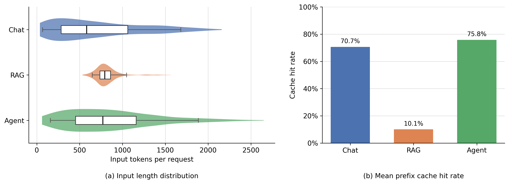
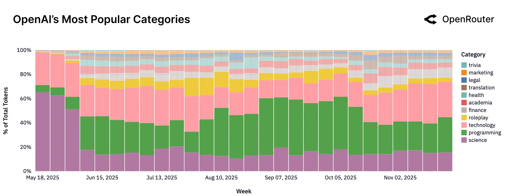
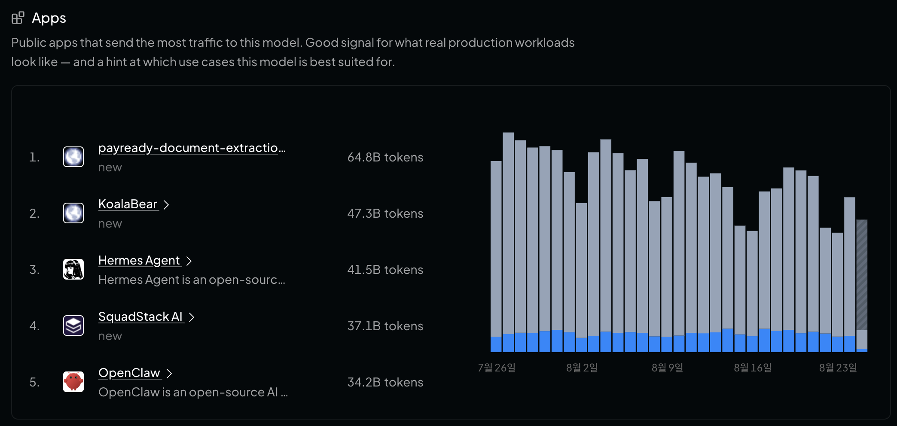

# QuotaServe: Workload-Aware KV Cache Eviction for Mixed LLM Serving

## Abstract

> 본 연구에서는 여러 workload가 하나의 GPU KV Cache를 공유할 때, category별 evictable cached KVCacheBlock 점유량과 새 KVCacheBlock 생성량이 클수록, 그리고 실제 prefix reuse가 적을수록 해당 category의 eviction 우선순위를 높이는 cache-local 정책인 QuotaServe를 제안한다.

---

## 1. Background and Problem Setting

### 1.1 Background

최근 LLM serving 환경에서는 하나의 모델이 Chat, Agent, RAG처럼 성격이 다른 workload를 동시에 처리한다. 이 workload들은 system prompt, 대화 이력, agent workflow template, retrieval document처럼 반복되는 prefix를 포함한다. 해당 prefix의 KV Cache를 재사용하면 prefill 연산을 생략할 수 있으므로, prefix caching은 TTFT와 inference cost를 줄이는 핵심 기법이다.

동일한 serving 조건에서도 workload별 request 구조와 prefix reuse 특성은 다르다. Figure 1(a)에서 Chat과 Agent는 turn 또는 tool step이 누적되면서 input-token 분포가 넓어져 p50/p95가 각각 `582/1,681`, `772/1,888` tokens로 나타난다. 반면 단일 query와 retrieval document로 구성된 RAG는 `793/1,048` tokens로 상대적으로 좁은 분포를 보인다. Figure 1(b)의 request별 mean cache hit rate는 Agent `75.8%`, Chat `70.7%`, RAG `10.1%`이다. 즉 Chat과 Agent는 이전 turn·step의 prefix를 반복적으로 재사용하지만, RAG는 request마다 retrieval context가 달라 공통 prefix 외의 재사용이 제한적이다.

*Figure 1. 동일한 vLLM 설정에서 측정한 Chat, RAG, Agent의 input-token 분포와 mean prefix-cache hit rate. Input-token 분포는 workload별 성공 요청 1,000건을 사용하며, cache hit rate는 vLLM이 prompt-token details를 반환한 999건의 평균이다. Violin은 전체 분포, 내부 box는 중앙값과 IQR, whisker는 p5-p95를 나타낸다.*

실제 LLM traffic은 서로 다른 task category로 구성되며, 그 구성은 시간에 따라 변한다. Figure 2는 OpenRouter에서 관찰한 OpenAI 모델 traffic이 programming, technology, roleplay, science, finance, health 등 여러 category에 걸쳐 있음을 보인다. 또한 Figure 3은 동일한 Gemini 2.5 Flash 모델로 traffic을 보내는 public application에 document extraction과 tool-using agent가 함께 포함됨을 보인다. 이 자료들은 heterogeneous workload가 범용 LLM serving의 현실적인 입력이라는 근거를 제공한다.

*Figure 2. OpenAI 모델 traffic의 category 구성 변화 [1].*

*Figure 3. Gemini 2.5 Flash에 traffic을 보내는 public application [2].*

### 1.2 Motivation

그러나 GPU KV Cache의 용량은 제한되어 있다. 여러 workload가 하나의 GPU KV Cache를 공유하면, 한 workload가 새로운 긴 prefix를 지속적으로 생성하는 동안 다른 workload의 재사용 가능한 cached prefix block이 eviction될 수 있다.

예를 들어 Agent workload가 일회성 document context를 계속 입력해 많은 KVCacheBlock을 생성하고, Chat workload는 반복되는 대화 prefix를 사용한다고 하자. 전역 LRU는 block의 최근 접근 시점만 본다. 따라서 Agent가 만든 새 block이 Chat의 재사용 가능한 prefix block을 밀어내고, 이후 Chat request가 cache miss와 prefill recomputation 비용을 부담할 수 있다.

이 문제에서는 category별 evictable cached KVCacheBlock 점유량, 새 KVCacheBlock 생성량, 실제 prefix reuse 정도를 함께 고려해야 한다. QuotaServe는 이 세 가지 관측값을 사용해 eviction할 category의 우선순위를 동적으로 조절한다.

### 1.3 Research Objective

QuotaServe의 목표는 고정된 GPU KV Cache 용량에서 전역 LRU 대비 workload category별 prefix-cache hit rate를 개선하고, 그에 따른 TTFT를 감소시키는 것이다.

### 1.4 System Model and Assumptions

QuotaServe는 하나의 LLM serving instance 안에서 발생하는 prefix-cache eviction만을 다룬다. 각 request는 frontend 또는 application layer에서 workload category를 명시적으로 전달하며, category는 `chat`, `agent`, `rag`와 같이 정의할 수 있다.

본 연구에서 eviction 대상은 prefix cache에 등록되어 있고, 현재 어떤 request도 참조하지 않는 `ref_cnt = 0` 상태의 cached KVCacheBlock이다. 실행 중인 request가 참조하는 KVCacheBlock은 eviction 대상으로 삼지 않는다.

---

## 2. QuotaServe Design

### 2.1 Per-Category Multi-Queue LRU

기본 vLLM prefix cache는 evictable cached KVCacheBlock을 하나의 전역 LRU free queue에 유지한다. QuotaServe는 이 전역 victim ordering을 category별 LRU queue로 대체한다. Category \(i\)의 queue \(Q_i\)는 해당 category에 속한 evictable cached KVCacheBlock을 관리한다.

$$
Q_i = \text{category } i \text{의 evictable cached KVCacheBlock을 관리하는 LRU queue}
$$

KVCacheBlock이 생성되면 QuotaServe는 생성 request의 category를 함께 기록한다. Request가 종료되어 block의 reference count가 0이 되면, QuotaServe는 해당 request의 block을 reverse order로 \(Q_i\)의 tail에 삽입한다. 이 순서는 긴 prefix의 뒤쪽 KVCacheBlock이 먼저 eviction되도록 하는 기존 vLLM LRU 동작을 보존한다. Prefix cache hit으로 block이 다시 참조되면 block은 queue에서 제거되어 실행 중인 request에 의해 보호되며, request가 종료되어 다시 free 상태가 되면 같은 순서로 queue에 재삽입된다. Victim category가 선택된 뒤에는 해당 queue의 head, 즉 category 내부에서 가장 오래 사용되지 않은 KVCacheBlock을 eviction한다.

### 2.2 Runtime Metrics

QuotaServe는 category \(i\)마다 evictable cached KVCacheBlock 점유량 \(x_i\), 새 KVCacheBlock 생성량 \(a_i\), 실제 prefix reuse량 \(h_i\)를 유지한다. 생성량과 reuse량은 최근 관측 window의 event count에 EWMA를 적용해 계산한다.

$$
x_i = |Q_i|
$$

$$
a_i = \operatorname{EWMA}(\text{category } i \text{가 새로 생성한 KVCacheBlock 수})
$$

$$
h_i = \operatorname{EWMA}(\text{category } i \text{가 prefix hit으로 재사용한 KVCacheBlock 수})
$$

\(a_i\)는 category \(i\) request가 새 full KVCacheBlock을 생성해 prefix cache에 등록할 때마다 증가한다. \(h_i\)는 category \(i\) request가 prefix cache lookup에서 재사용한 full KVCacheBlock마다 증가한다. 따라서 prefix hit 뒤에 새 suffix block을 생성한 request는 재사용한 block 수만큼 \(h_i\)를, 새로 생성되어 cache에 등록된 full KVCacheBlock 수만큼 \(a_i\)를 각각 증가시킨다.

\(x_i\)는 현재 어떤 request도 참조하지 않는 evictable cached KVCacheBlock만 포함한다. \(a_i\)와 \(h_i\)는 같은 KVCacheBlock 단위를 사용한다. \(h_i = 0\)인 경우 분모가 0이 되는 것을 막기 위해, 작은 양수 \(\epsilon\)을 더한다.

### 2.3 Eviction Pressure

QuotaServe는 각 category의 eviction pressure를 다음과 같이 계산한다.

$$
P_i =
\frac{x_i}{\sum_j x_j}
\cdot
\frac{a_i}{h_i + \epsilon}
$$

첫 항은 category \(i\)의 evictable cached KVCacheBlock 점유 비율이고, 두 번째 항은 실제 prefix reuse량 대비 새 KVCacheBlock 생성량이다. 따라서 evictable cached KVCacheBlock을 많이 점유하고 새 KVCacheBlock을 많이 생성하지만 prefix hit으로 재사용되는 block이 적은 category일수록 높은 pressure를 갖는다.

### 2.4 Victim Selection

새 request에 KVCacheBlock을 할당할 때 uncached free block이 남아 있으면, allocator는 해당 block을 그대로 사용하며 QuotaServe는 실행하지 않는다. Uncached free block이 모두 소진되어 cached free KVCacheBlock을 재활용해야 할 때만 QuotaServe가 실행된다. 이때 QuotaServe는 non-empty \(Q_i\)를 가진 category의 pressure를 계산하고, victim category \(i\)를 pressure에 비례하는 확률로 선택한다.

$$
\Pr(\mathrm{victim\ category}=i)
= \frac{P_i}{\sum_{j:Q_j \neq \emptyset} P_j}
$$

선택된 category의 \(Q_i\) head를 eviction하며, 필요한 block 수를 확보할 때까지 이 절차를 반복한다. 모든 eligible category의 pressure가 0이면 QuotaServe는 기존 vLLM 전역 LRU eviction을 fallback으로 사용한다. 모든 \(Q_i\)가 비어 있으면 evictable cached KVCacheBlock이 없으므로, QuotaServe는 victim을 선택하지 않고 기존 scheduler의 처리 경로를 따른다.

---

## 3. Related Work

- **Cache-aware routing:** prefix cache hit이 가능한 replica로 request를 보내 prefill을 줄이는 routing 기법이다 [3].
- **Joint routing and cache eviction:** 제한된 KV Cache에서 routing과 eviction의 trade-off를 함께 모델링하는 접근이다 [4].
- **Prefill/decode scheduling 및 disaggregation:** prefill과 decode를 분리하거나 각각에 맞게 scheduling하는 접근이다 [5, 6].
- **Batching:** iteration-level scheduling과 continuous batching으로 request 처리 순서 및 batch 구성을 조절하는 접근이다 [7].
- **KV Cache offloading 및 hierarchy:** GPU KV Cache를 CPU memory 또는 분산 storage 계층으로 확장하는 접근이다 [8].
- **Model execution:** tensor parallelism, pipeline parallelism 등으로 model execution을 분산하는 접근이다 [9].

---

## References

[1] OpenRouter. *State of AI: An Empirical 100 Trillion Token Study with OpenRouter*, December 2025. Available: https://openrouter.ai/state-of-ai. Accessed: August 25, 2026.

[2] OpenRouter. *Google: Gemini 2.5 Flash*. Available: https://openrouter.ai/google/gemini-2.5-flash. Accessed: August 25, 2026.

[3] Preble. Available: https://arxiv.org/abs/2407.00023.

[4] KVRouting. Available: https://openreview.net/pdf?id=R7fv5NWfMm.

[5] Splitwise. Available: https://arxiv.org/abs/2311.18677.

[6] DistServe. Available: https://arxiv.org/abs/2401.09670.

[7] Orca. Available: https://www.usenix.org/conference/osdi22/presentation/yu.

[8] Mooncake. Available: https://arxiv.org/abs/2407.00079.

[9] Megatron-LM. Available: https://arxiv.org/abs/1909.08053.
