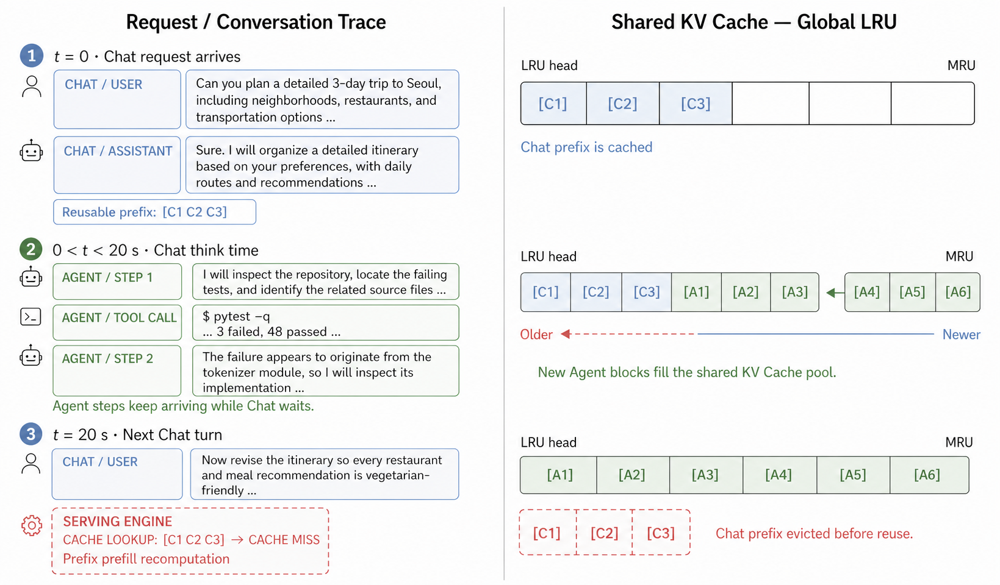

# QuotaServe: Application-Level Soft KV Cache Quotas in Front of Global LRU

## Abstract

하나의 LLM serving instance는 API를 통해 programming, roleplay, general Q&A, productivity, education 등 서로 다른 도메인을 다루는 여러 애플리케이션의 요청을 함께 처리하며, 이 애플리케이션들은 동일한 논리적 KV Cache pool을 공유한다. 애플리케이션은 최근 자신의 `Input + Output` token 규모와 `Cached / Input` 재사용 성향에 비례하는 만큼의 KV Cache를 확보하면 단독 실행에 가까운 hit rate와 throughput을 낸다.

문제는 그만큼의 KV Cache를 보장하는 주체가 없다는 점이다. vLLM을 비롯한 현재 serving engine은 evictable cached block을 전역 LRU 하나로 관리하므로, victim 선택이 애플리케이션 단위의 기준 없이 순간적인 request 분포에 의해 결정된다. 도착률이 높거나 신규 block 생성량이 많은 애플리케이션이 free queue를 자신의 최근 block으로 계속 채우면, think time이나 tool execution을 기다리던 다른 애플리케이션의 재사용 가능한 prefix가 queue head 쪽으로 밀려 재사용되기 전에 통째로 방출된다. 본 연구는 이를 **cross-application cache interference**로 정의한다.

QuotaServe는 global LRU와 application-level victim selection을 결합해 이 문제를 완화한다. 애플리케이션별 input, output, cached token rate를 request 기반 EWMA로 추적해 borrowable soft-quota 비율을 계산하고, cached block을 회수해야 할 때 quota를 초과한 애플리케이션을 global LRU보다 먼저 victim으로 선택한다. 선택된 애플리케이션 내부의 block은 기존 LRU 순서에 따라 회수한다. Cache capacity에 여유가 있는 동안에는 애플리케이션이 quota를 초과해 block을 보관할 수 있으며, eviction이 필요해지면 초과분부터 회수된다.

---

## 1. Introduction

### 1.1 Mixed-Application LLM Serving

LLM을 API 형태로 배포하면 하나의 물리적 또는 논리적 serving instance가 서로 다른 도메인의 애플리케이션 요청을 함께 처리한다. OpenRouter가 100조 개가 넘는 token의 실제 platform traffic을 분석한 결과, programming, roleplay, translation, general Q&A, productivity, education, creative writing 등 다양한 사용 도메인이 관찰되었다 [1]. 이러한 애플리케이션의 LLM 호출은 주로 multi-turn 대화를 이어가는 Chat과 tool 호출 및 reasoning step을 반복하는 Agent 형태로 구성되며, 동일한 model과 논리적 KV Cache pool을 공유한다.

Chat은 대화 이력을 다음 turn의 입력에 포함하고, Agent는 이전 step의 지시문, model output, tool 결과를 다음 호출의 prefix로 다시 사용한다. 이러한 호출 구조는 이전에 계산한 KV state를 재사용할 수 있는 높은 잠재력을 제공한다. Agentix는 동일 program에 속한 LLM call 사이에서 90% 이상의 prefix-cache hit rate를 보고했으며, TraceLab은 coding-agent workload에서 긴 context의 반복 사용과 tool 호출 및 human-paced gap을 관찰했다. SGLang 또한 multi-turn Chat의 대화 이력과 Agent program의 이전 호출에서 KV Cache를 재사용할 수 있음을 보였다 [2, 3, 4].

본 연구에서 동일한 vLLM 설정으로 측정한 ShareGPT와 Terminal-Bench 역시 유사한 규모의 input-token 분포를 보였다. 두 benchmark의 request별 mean prefix-cache hit rate는 각각 `70.7%`와 `75.8%`였다(Figure 1).

*Figure 1. 동일한 vLLM 설정에서 측정한 ShareGPT와 Terminal-Bench benchmark의 input-token distribution과 평균 KV-cache hit rate. 각 benchmark는 성공 요청 1,000건을 사용했으며, 왼쪽은 request별 input-token histogram, 오른쪽은 prefix-cache hit rate의 평균을 나타낸다.*

Prefix cache hit의 이익은 해당 prefix를 재사용하는 애플리케이션에 귀속된다. 애플리케이션 $i$의 cache hit은 $i$의 반복 prefix에 대한 prefill 연산과 지연을 줄이지만, 애플리케이션 $j$의 cache hit은 $i$에서 발생한 cache miss를 상쇄하지 못한다. 따라서 공유 cache의 aggregate hit rate가 높게 유지되더라도 특정 애플리케이션의 hit rate가 낮아지면, 해당 애플리케이션이 경험하는 TTFT와 serving cost는 증가할 수 있다 [4]. 이러한 특성은 공유 cache의 성능을 aggregate metric뿐 아니라 애플리케이션별 metric으로 평가해야 함을 시사한다.

### 1.2 Cross-Application Cache Interference under Global LRU

vLLM의 automatic prefix caching은 현재 어떤 request도 참조하지 않는 cached KVCacheBlock을 하나의 free queue에서 전역 LRU 순서로 관리한다 [5, 6]. 새로운 allocation에 사용할 uncached free block이 없으면 queue head의 cached block에서 기존 hash metadata를 제거하고, 해당 block을 새 request에 재할당한다. Prefix-cache hit으로 다시 참조된 block은 queue에서 제거되며, request가 종료된 뒤에는 최근 참조 순서에 따라 다시 queue에 배치된다.

이 방식은 모든 애플리케이션의 block을 접근 recency라는 하나의 기준으로 정렬한다. Request mix가 안정적이고 reuse interval이 짧을 때는 반복적으로 참조되는 hot block이 queue head에서 멀어지므로 효과적으로 보호된다. 반면 여러 애플리케이션이 서로 다른 도착률, token 생성량, reuse interval을 보이면, 각 애플리케이션이 유지하는 cache occupancy는 요청이 interleave되는 방식에 민감해진다. 최근 연구에서도 heterogeneous workload는 서로 다른 prefix reuse pattern을 보이며, 하나의 고정된 eviction heuristic이 모든 workload에서 일관되게 우수하지 않음을 확인했다 [7].

Figure 2는 이러한 간섭이 발생하는 전형적인 시나리오를 보여준다. Chat 애플리케이션의 request가 종료된 뒤 다음 turn이 도착하기까지 20초의 think time이 있다고 하자. 이 시간 동안 Agent 애플리케이션이 여러 step을 실행하며 신규 full block을 계속 생성하면, Agent의 block이 queue tail에 추가되는 동안 Chat prefix는 queue head에 가까워진다. Cache pressure가 충분히 커지면 Chat prefix는 다음 turn에서 재사용되기 전에 eviction되고, 이후 Chat request는 동일한 prefix를 다시 prefill해야 한다. 이 현상은 Agent의 prefix reuse가 높더라도 발생할 수 있다. Chat과 Agent가 모두 높은 reuse를 보이더라도 block 생성률과 reuse interval이 다르면, 한 애플리케이션의 재사용 가능한 block이 다른 애플리케이션의 최근 block에 의해 밀려날 수 있다.

*Figure 2. Global LRU에서 발생하는 cross-application KV-cache interference. Chat의 20초 think time 동안 Agent가 생성한 신규 KV Cache block이 shared queue를 채우면서 재사용 가능한 Chat prefix가 LRU head로 밀려 eviction되고, 다음 Chat turn에서 cache miss와 prefix prefill recomputation이 발생한다.*

본 연구는 이러한 현상을 **cross-application cache interference**로 정의한다. 이를 완화하려면 애플리케이션 간 cache allocation을 조정하는 기준과 각 애플리케이션 내부에서 block의 recency를 판단하는 기준을 분리해야 한다. QuotaServe는 애플리케이션별 quota 상태로 victim application을 먼저 선택하고, 선택된 애플리케이션 내부에서는 기존 LRU 순서를 적용하는 계층적 victim selection을 사용한다.

### 1.3 QuotaServe Overview

QuotaServe의 목표는 각 애플리케이션이 단독 실행에서 얻는 prefix-cache 이익을 shared execution에서도 안정적으로 유지하는 것이다.

애플리케이션별 cache quota는 최근 workload 규모와 관측된 prefix reuse를 함께 반영해야 한다. QuotaServe는 serving engine이 request별로 관측하는 input, output, cached token 수에서 다음 두 runtime signal을 계산한다.

- `Input + Output` tokens: 애플리케이션의 최근 token demand
- `Cached / Input` 비율: prefix가 실제로 재사용된 정도

첫 번째 신호는 애플리케이션이 최근 처리한 token 규모를 나타내고, 두 번째 신호는 cache에 유지된 prefix가 실제 request에서 재사용되는 정도를 나타낸다. QuotaServe는 두 신호의 EWMA를 결합해 애플리케이션별 soft-quota 비율을 계산한다.

QuotaServe는 global LRU를 대체하지 않고, 그 앞단에 애플리케이션 단위의 victim selection을 추가한다. Soft quota는 cache occupancy의 hard limit으로 동작하지 않으므로, cache pressure가 없는 동안에는 애플리케이션이 quota를 초과해 유휴 capacity를 사용할 수 있다.

새로운 allocation으로 eviction이 필요해지면 quota 초과율이 가장 큰 애플리케이션을 먼저 선택하고, 해당 애플리케이션의 local-LRU head에서 victim block을 가져온다. 이 borrowing 방식은 cache를 정적으로 분할하지 않으면서 애플리케이션 내부의 기존 recency 정보를 유지하고 재사용 가능한 prefix를 보호한다.

본 연구의 기여는 다음과 같다.

1. 동일한 serving instance를 공유하는 애플리케이션 사이의 cache interference를 애플리케이션별 cache hit rate와 TTFT 저하로 정의하고, global LRU 환경에서 이를 정량화한다.
2. Request별 input, output, cached token을 EWMA로 추적해 애플리케이션별 borrowable soft quota를 계산하는 runtime controller를 제안한다.
3. 애플리케이션 단위 victim selection과 application-local LRU를 결합해, 기존 LRU의 recency 정보를 유지하면서 cross-application cache interference를 완화하는 계층적 eviction policy를 설계한다.

---

## 5. Related Work

- **Cache-aware routing:** prefix cache hit이 가능한 replica로 request를 보내 prefill을 줄이는 routing 기법이다 [8]. QuotaServe는 instance가 선택된 뒤 그 내부 cache의 애플리케이션별 격리를 다룬다.
- **Joint routing and cache eviction:** 제한된 KV Cache에서 routing과 eviction의 trade-off를 함께 모델링하는 접근이다 [9]. QuotaServe는 multi-instance routing을 변경하지 않는다.
- **Prefill/decode scheduling 및 disaggregation:** prefill과 decode를 분리하거나 각각에 맞게 scheduling하는 접근이다 [10, 11]. QuotaServe는 evictable prefix-cache block의 victim selection에만 개입한다.
- **Batching:** iteration-level scheduling과 continuous batching으로 request 처리 순서 및 batch 구성을 조절하는 접근이다 [12].
- **KV Cache offloading 및 hierarchy:** GPU KV Cache를 CPU memory 또는 분산 storage 계층으로 확장하는 접근이다 [13].
- **Model execution:** tensor parallelism, pipeline parallelism 등으로 model execution을 분산하는 접근이다 [14].

---

## References

[1] OpenRouter. *State of AI: An Empirical 100 Trillion Token Study with OpenRouter*, December 2025. Available: https://openrouter.ai/state-of-ai. Accessed: September 2, 2026.

[2] Z. Luo et al. *Agentix: An Efficient Serving Engine for LLM Agents as General Programs*. USENIX NSDI, 2026. Available: https://www.usenix.org/system/files/conference/nsdi26/nsdi26spring_luo_prepub.pdf.

[3] K. Zhu et al. *TraceLab: Characterizing Coding Agent Workloads for LLM Serving*. arXiv:2606.30560, 2026. Available: https://arxiv.org/abs/2606.30560.

[4] L. Zheng et al. *SGLang: Efficient Execution of Structured Language Model Programs*. NeurIPS, 2024. Available: https://papers.nips.cc/paper_files/paper/2024/file/724be4472168f31ba1c9ac630f15dec8-Paper-Conference.pdf.

[5] vLLM. *Automatic Prefix Caching*. Available: https://docs.vllm.ai/en/latest/design/prefix_caching/. Accessed: September 2, 2026.

[6] W. Kwon et al. *Efficient Memory Management for Large Language Model Serving with PagedAttention*. SOSP, 2023. Available: https://arxiv.org/abs/2309.06180.

[7] B. Ouyang, Y. Qiao, and J. Xing. *UniCache: Unifying Prefix Cache Eviction for Heterogeneous LLM Serving Workloads*. Proc. ACM Meas. Anal. Comput. Syst., 10(2), Article 54, 2026. Available: https://doi.org/10.1145/3805652.

[8] Preble. Available: https://arxiv.org/abs/2407.00023.

[9] KVRouting. Available: https://openreview.net/pdf?id=R7fv5NWfMm.

[10] Splitwise. Available: https://arxiv.org/abs/2311.18677.

[11] DistServe. Available: https://arxiv.org/abs/2401.09670.

[12] Orca. Available: https://www.usenix.org/conference/osdi22/presentation/yu.

[13] Mooncake. Available: https://arxiv.org/abs/2407.00079.

[14] Megatron-LM. Available: https://arxiv.org/abs/1909.08053.
