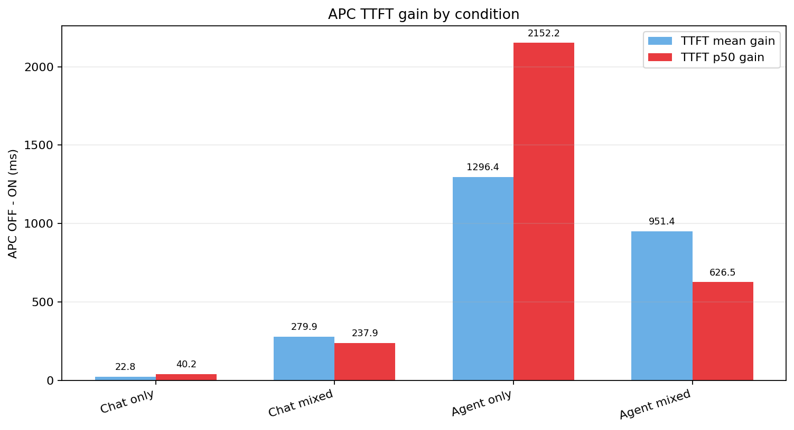
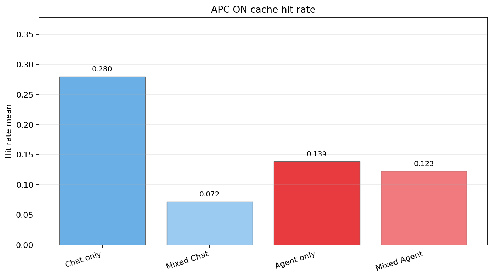
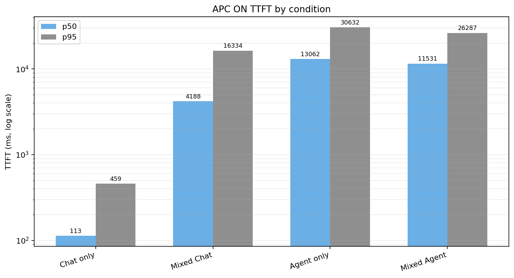
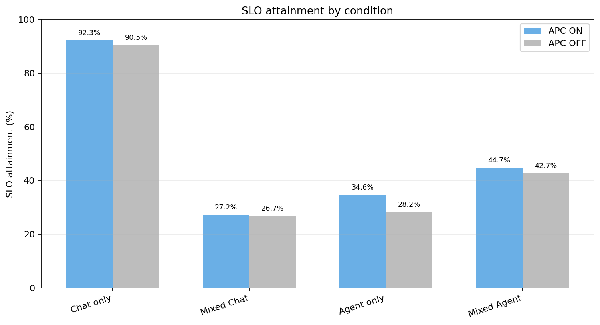
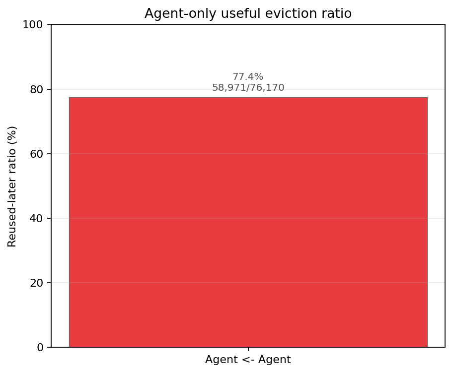
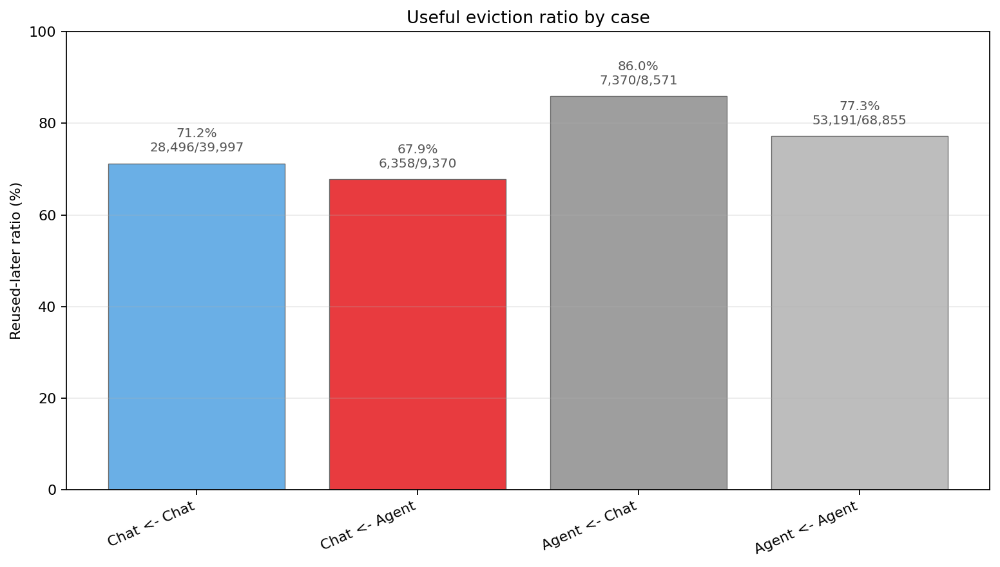

# Chat + Agent 분석

## 1. 분석 목적

이 문서는 Terminal-Bench trajectory 기반 Agent workload를 Chat과 섞었을 때, prefix cache 이득과 eviction attribution이 어떻게 변하는지 확인하는 분석이다.

기존 `case1_validation/analysis_results/CASE1_ANALYSIS.md`는 Chat+RAG/Longctx 결과를 정리한다. 이 문서는 같은 구조를 따르되, antagonist를 RAG/Longctx가 아니라 multi-step Agent workload로 바꿔 해석한다.

먼저 확인할 질문은 다음 다섯 가지다.

1. Chat+Agent mixed에서 Chat hit rate가 Chat-only 대비 떨어지는가?
2. Chat+Agent mixed에서 Chat TTFT와 SLO attainment가 악화되는가?
3. Agent-only에서 Agent prefix cache reuse가 관측되는가?
4. Agent가 Chat hot cache를 직접 evict하고, 그 block이 이후 다시 필요한가?
5. Agent 자체도 보호할 reusable prefix를 갖는가?

APC gain은 기존 Case 1과 같이 계산한다.

```text
APC_gain = TTFT(APC OFF) - TTFT(APC ON)
```

값이 클수록 APC ON이 해당 조건의 TTFT를 더 줄인 것이다.

## 2. 분석 파일 및 실험 조건

<details>
<summary>상세 내용</summary>

### 2.1 사용한 결과 파일

Chat-only baseline은 기존 Case 1 결과를 재사용했다. 서버 옵션은 동일하고, Agent 실험에서만 Agent prompt 수용을 위해 `max_model_len`이 `8192`에서 `12288`로 증가했다.

| 조건 | 파일 |
|---|---|
| Chat-only APC ON/OFF | `hypothesis_validation/case1_validation/raw_results/chat_only_apc_on_summary.json` / `chat_only_apc_off_summary.json` |
| Agent-only APC ON | `agent_only_exp2_cap20_apc_on_len12288.jsonl` |
| Agent-only APC OFF | `agent_only_exp2_cap20_apc_off_len12288_summary.json` / `.jsonl` |
| Chat+Agent mixed APC ON | `chat_traj_agent_exp2_cap20_apc_on_len12288_summary.json` / `.jsonl` |
| Chat+Agent mixed APC OFF | `chat_traj_agent_exp2_cap20_apc_off_len12288_summary.json` / `.jsonl` |
| Agent-only APC ON eviction log | `Eviction_agent_only_exp2_cap20_apc_on_len12288.jsonl` |
| Chat+Agent mixed APC ON eviction log | `Eviction_chat_traj_agent_exp2_cap20_apc_on_len12288.jsonl` |

`Agent-only APC ON`은 summary 파일이 없어서 runner JSONL에서 같은 방식으로 재계산했다.

### 2.2 워크로드 조건

| 항목 | 값 |
|---|---|
| Chat | `100 conversations x 10 turns = 1000 requests` |
| Agent | `100 sessions x 10 steps = 1000 requests` |
| Mixed | Chat `1000` + Agent `1000` requests |
| Chat qps | `5` |
| Agent target rps | `5` |
| Agent session start rps | `0.5` |
| Agent tool gap | `min(expovariate(mean=2s), 20s)` |
| SLO | Chat `400ms`, Agent `10000ms` |
| Agent context | `max_model_len=12288` |
| Server | `max_num_seqs=32`, `gpu_memory_utilization=0.6` |

### 2.3 주의점

이번 Chat+Agent mixed run은 queue delay가 매우 크다. 따라서 절대 TTFT/SLO 값에는 cache 효과뿐 아니라 serving overload 효과도 크게 섞여 있다.

다만 같은 workload 조건에서 APC ON/OFF를 비교하는 APC gain과, APC ON eviction attribution은 여전히 의미가 있다.

</details>

## 3. 핵심 결과 요약

| 확인 항목 | 관측 결과 | 판단 |
|---|---|---|
| Chat hit rate | Chat-only `0.280`에서 mixed Chat `0.072`로 감소 | Chat cache hit가 크게 감소 |
| Chat TTFT/SLO | Chat-only ON p50 `113.35ms`, SLO `92.3%`에서 mixed Chat ON p50 `4187.52ms`, SLO `27.2%` | mixed에서 Chat 품질이 크게 악화 |
| Agent self reuse | Agent-only ON hit rate `0.139`, `agent <- agent` useful eviction `58,971` | Agent-only에서도 delayed prefix reuse가 있음 |
| Agent in mixed | mixed Agent ON hit rate `0.123`, `agent <- agent` useful eviction `53,191` | mixed에서도 Agent self-reuse가 유지됨 |
| Chat <- Agent eviction | `chat <- agent` useful eviction `6,358/9,370 = 67.9%` | Agent가 Chat의 reusable cache를 직접 밀어냄 |
| Agent <- Agent eviction | `agent <- agent` useful eviction `53,191/68,855 = 77.3%` | Agent는 단순 low-reuse pressure가 아니라 보호할 prefix도 가짐 |
| APC gain | Agent-only p50 gain `2152.17ms`, mixed Agent p50 gain `626.54ms` | Agent APC 이득은 mixed에서 줄어듦 |
| Mixed serving | mixed Chat/Agent 모두 queue delay가 큼 | latency 절대값 해석에는 overload 주의 필요 |

## 4. APC gain 확인



*Figure 1. APC OFF - APC ON으로 계산한 TTFT gain. Agent-only의 p50 gain이 가장 크고, mixed Agent에서는 그 gain이 줄어든다.*

| Workload scope | TTFT mean gain | TTFT p50 gain | TTFT p95 gain | TTFT p99 gain | SLO gain |
|---|---:|---:|---:|---:|---:|
| Chat-only | 22.75ms | 40.20ms | 14.89ms | 53.70ms | +1.8pp |
| Mixed Chat | 279.91ms | 237.94ms | 407.45ms | 2544.30ms | +0.5pp |
| Agent-only | 1296.37ms | 2152.17ms | 1458.70ms | 871.23ms | +6.4pp |
| Mixed Agent | 951.44ms | 626.54ms | 847.05ms | 679.99ms | +2.0pp |

Agent-only에서는 APC가 Agent p50 TTFT를 `2152.17ms` 줄인다. 하지만 Chat+Agent mixed에서는 Agent p50 gain이 `626.54ms`로 줄어든다. 따라서 Agent workload의 APC 이득은 mixed 환경에서 약해진다.

Chat은 mixed에서 p50 gain이 `237.94ms`로 Chat-only보다 커 보인다. 하지만 이 run은 mixed queue delay가 매우 커서, Chat의 APC gain은 cache 효과만으로 해석하기 어렵다. Chat에 대해서는 gain보다 절대 hit rate와 SLO 악화를 중심으로 보는 것이 안전하다.

## 5. 확인 1: mixed에서 Chat hit rate가 떨어지는가?

APC ON 기준으로 Chat hit rate는 Chat-only 대비 크게 감소한다.



*Figure 2. APC ON cache hit rate mean. Chat은 single에서 mixed로 갈 때 크게 낮아지고, Agent는 mixed에서도 self-reuse를 일부 유지한다.*

| 조건 | Workload | Hit rate mean | Hit rate p50 | single 대비 변화 |
|---|---|---:|---:|---:|
| Chat-only | Chat | 0.280 | 0.070 | 기준 |
| Chat+Agent mixed | Chat | 0.072 | 0.028 | -74.3% |
| Agent-only | Agent | 0.139 | 0.072 | 기준 |
| Chat+Agent mixed | Agent | 0.123 | 0.069 | -11.4% |

Chat hit rate는 `0.280 -> 0.072`로 약 `74.3%` 감소한다. 반면 Agent hit rate는 `0.139 -> 0.123`으로 감소 폭이 작다. 즉 mixed에서 Chat cache reuse가 더 크게 흔들린다.

## 6. 확인 2: mixed에서 Chat TTFT와 SLO가 악화되는가?

APC ON 기준으로 Chat TTFT와 SLO는 mixed에서 크게 악화된다.



*Figure 3. APC ON TTFT p50/p95. 값의 범위가 커서 y축은 log scale이다.*

| 조건 | Workload | TTFT mean | TTFT p50 | TTFT p95 | TTFT p99 | SLO attainment |
|---|---|---:|---:|---:|---:|---:|
| Chat-only ON | Chat | 171.97ms | 113.35ms | 458.96ms | 646.64ms | 92.3% |
| Chat+Agent mixed ON | Chat | 5588.04ms | 4187.52ms | 16333.91ms | 22652.66ms | 27.2% |
| Agent-only ON | Agent | 15107.95ms | 13061.72ms | 30631.71ms | 33320.55ms | 34.6% |
| Chat+Agent mixed ON | Agent | 12003.33ms | 11531.20ms | 26287.45ms | 29827.58ms | 44.7% |



*Figure 4. 조건별 SLO attainment. Chat-only는 높은 SLO를 유지하지만, mixed Chat은 400ms SLO를 크게 놓친다.*

Chat SLO는 `92.3% -> 27.2%`로 `-65.1pp` 감소한다. Chat p50 TTFT도 `113.35ms -> 4187.52ms`로 크게 증가한다.

다만 mixed run의 queue delay가 매우 커서 이 절대값은 cache eviction만의 효과로 보면 안 된다.

| 조건 | Workload | Queue delay mean | Queue delay p95 |
|---|---|---:|---:|
| Agent-only ON | Agent | 16,329.70ms | 34,306.25ms |
| Agent-only OFF | Agent | 19,087.20ms | 37,842.59ms |
| Mixed ON | Chat | 86,477.01ms | 245,011.10ms |
| Mixed ON | Agent | 54,956.70ms | 225,009.59ms |
| Mixed OFF | Chat | 93,213.84ms | 261,207.70ms |
| Mixed OFF | Agent | 59,193.10ms | 234,307.72ms |

즉 Chat+Agent mixed는 현재 load에서 서버 처리량을 넘어선다. SLO 악화는 실험적으로 중요한 현상이지만, cache policy 효과와 capacity overload 효과가 함께 들어 있다.

## 7. 확인 3: Agent-only에서 delayed prefix reuse가 보이는가?

Agent-only APC ON에서 hit rate와 eviction attribution 모두 Agent self-reuse를 보여준다.

| 조건 | Hit rate mean | Hit rate p50 | TTFT p50 | SLO attainment |
|---|---:|---:|---:|---:|
| Agent-only APC ON | 0.139 | 0.072 | 13061.72ms | 34.6% |
| Agent-only APC OFF | - | - | 15213.89ms | 28.2% |



*Figure 5. Agent-only APC ON에서 `agent <- agent` eviction의 reused-later ratio.*

| Direction | Count | Useful count | Useful ratio | time_until_next_reuse p50 | time_until_next_reuse p95 |
|---|---:|---:|---:|---:|---:|
| `agent <- agent` | 76,170 | 58,971 | 77.4% | 44.51s | 59.72s |

Agent-only에서도 evict된 Agent block의 `77.4%`가 이후 다시 사용된다. 이는 trajectory Agent workload가 단순히 긴 prompt를 한 번 넣고 끝나는 workload가 아니라, session 내부 delayed reuse를 갖는다는 뜻이다.

## 8. 확인 4: Agent가 Chat hot cache를 직접 evict하는가?

Chat+Agent mixed APC ON eviction log의 전체 eviction은 `126,793`건이다.

```text
reused_later=true:   95,415
reused_later=false:  31,378
overall useful ratio: 75.3%
```



*Figure 6. Chat+Agent mixed APC ON에서 eviction 방향별 `reused_later` ratio.*

| Direction | Count | Useful count | Useful ratio | Total eviction 중 비율 | time_until_next_reuse p50 | time_until_next_reuse p95 |
|---|---:|---:|---:|---:|---:|---:|
| `chat <- chat` | 39,997 | 28,496 | 71.2% | 31.5% | 51.75s | 77.11s |
| `chat <- agent` | 9,370 | 6,358 | 67.9% | 7.4% | 40.27s | 72.84s |
| `agent <- chat` | 8,571 | 7,370 | 86.0% | 6.8% | 130.06s | 283.02s |
| `agent <- agent` | 68,855 | 53,191 | 77.3% | 54.3% | 50.09s | 60.75s |

핵심은 `chat <- agent`다. Agent가 Chat block을 evict한 사건은 `9,370`건이고, 그중 `6,358`건이 이후 다시 사용됐다. useful ratio는 `67.9%`다.

즉 Agent는 Chat hot cache를 실제로 밀어냈고, 그중 상당수는 이후 Chat turn에서 다시 필요했던 block이다.

## 9. 확인 5: Agent도 보호할 reusable prefix를 갖는가?

Agent는 Chat을 밀어내는 antagonist이지만, 동시에 자기 자신도 강한 self-reuse를 가진다.

| 조건 | Direction | Count | Useful count | Useful ratio |
|---|---|---:|---:|---:|
| Agent-only | `agent <- agent` | 76,170 | 58,971 | 77.4% |
| Chat+Agent mixed | `agent <- agent` | 68,855 | 53,191 | 77.3% |

Agent self eviction의 useful ratio는 single과 mixed 모두 약 `77%`다. 따라서 Agent는 Longctx처럼 "쫓겨나도 별로 다시 안 쓰이는" pure pressure workload로 보기 어렵다.

정책적으로는 다음 두 신호를 동시에 봐야 한다.

```text
chat <- agent useful eviction: Chat 보호 필요성
agent <- agent useful eviction: Agent도 보호할 가치가 있음
```

## 10. 1차 결론

현재 결과로는 다음 결론을 둘 수 있다.

1. Chat+Agent mixed에서 Chat hit rate는 Chat-only `0.280`에서 `0.072`로 크게 감소한다.
2. Chat+Agent mixed에서 Chat SLO는 `92.3%`에서 `27.2%`로 감소한다. 다만 mixed run은 queue delay가 매우 커서 절대 latency는 overload 효과를 포함한다.
3. Agent-only APC ON은 hit rate `0.139`와 `agent <- agent` useful eviction `58,971`건을 보인다. Agent workload는 delayed prefix reuse를 만든다.
4. Chat+Agent mixed에서 `chat <- agent` useful eviction은 `6,358`건이다. Agent가 Chat의 reusable cache를 직접 밀어낸다는 attribution 신호가 있다.
5. Chat+Agent mixed에서 `agent <- agent` useful eviction은 `53,191`건이다. Agent도 자기 cache를 다시 쓰므로, Agent cap을 무작정 낮추는 정책은 Agent self-reuse를 해칠 수 있다.
6. Agent APC p50 gain은 Agent-only `2152.17ms`에서 mixed `626.54ms`로 줄어든다. Agent의 prefix cache 이득은 mixed 환경에서 약해진다.

따라서 Chat+Agent 실험은 "Agent가 Chat hot cache를 밀어낸다"는 위험 신호와 "Agent도 reusable cache를 가진다"는 보호 신호를 동시에 보여준다. Quota 정책은 Chat floor를 올려 `chat <- agent` useful eviction을 줄이되, Agent self-reuse를 완전히 버리지 않는 방향으로 설계해야 한다.

## 11. 남은 주의점

이번 mixed run은 queue delay가 매우 크다.

```text
Mixed ON Chat queue delay p95: 245.0s
Mixed ON Agent queue delay p95: 225.0s
Mixed OFF Chat queue delay p95: 261.2s
Mixed OFF Agent queue delay p95: 234.3s
```

따라서 이 문서의 eviction attribution 결론은 강하지만, latency/SLO 절대값은 "cache-only 손해"로 해석하면 안 된다. 최종 논문용 latency 그래프에서는 같은 조건의 APC ON/OFF 비교와 함께, 필요하면 lower-load 보조 run을 추가해 queue-dominated 현상이 완화되는지 확인하는 것이 좋다.
