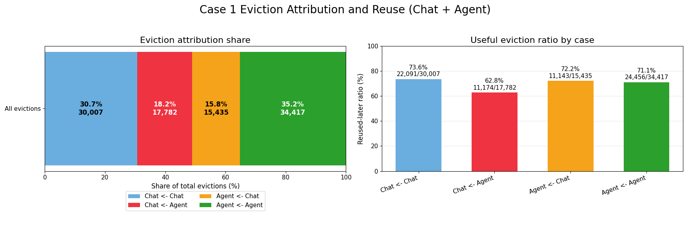
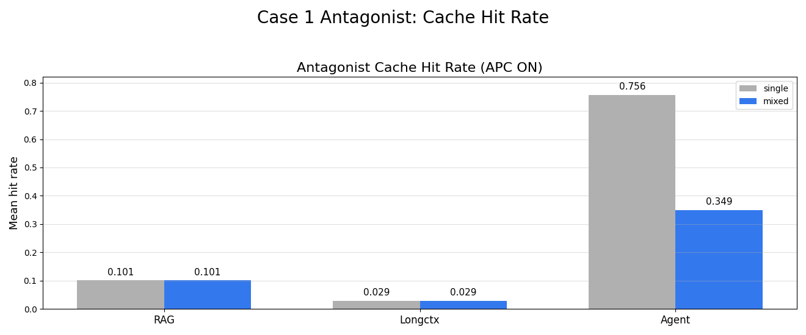
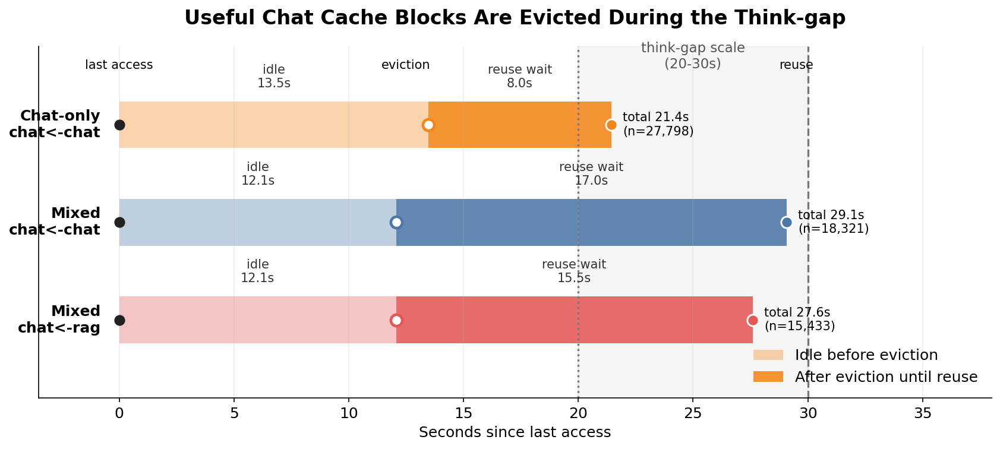
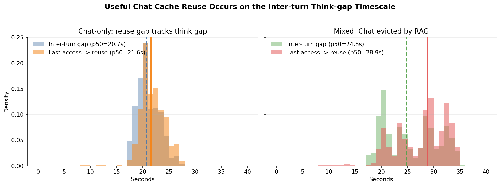

# Case 1 분석

## 1. 분석 목적

`HYPOTHESIS.md`의 Case 1은 single workload와 mixed workload를 각각 APC ON/OFF로 비교해, mixed 환경에서 prefix cache의 이득이 single workload만큼 유지되는지 확인하는 실험이다.

이 문서는 먼저 `HYPOTHESIS.md`의 Case 1 체크리스트에 해당하는 내용만 앞에서 검증한다. 그 범위를 벗어나는 해석, 보조 관찰, 추가 그림은 뒤쪽의 "부가 관찰"로 분리한다.

Case 1에서 먼저 확인할 질문은 다음 여섯 가지다.

1. mixed에서 Chat hit rate가 떨어지는가?
2. mixed에서 Chat TTFT가 증가하는가?
3. mixed에서 Chat SLO attainment가 감소하는가?
4. mixed에서 antagonist(RAG/Longctx/Agent)의 TTFT와 SLO attainment는 어떻게 변하는가?
5. mixed에서 RAG보다 cache pressure가 큰 Longctx가 Chat hot cache를 더 많이 직접 evict하는가? 특히 `chat <- longctx` useful eviction이 `chat <- rag`보다 크게 관측되어, antagonist pressure 증가가 Chat hit rate 감소의 cache-level 원인으로 연결되는가?
6. Chat+Agent mixed에서 `chat <- agent` useful eviction과 Agent 쪽 useful eviction이 함께 관측되는가?

다만 이 여섯 가지를 보기 전에, Case 1의 분리 측정 기준인 APC gain을 먼저 계산한다.

- `APC_gain_single = single(OFF) - single(ON)`
- `APC_gain_mixed  = mixed(OFF)  - mixed(ON)`
- 같은 workload 조건에서 APC ON/OFF만 바꿔 비교하면 scheduling/batching 효과는 대부분 공통으로 반영되므로, `APC OFF - APC ON`은 해당 조건에서 prefix cache가 제공한 이득을 근사한다.
- `APC_gain_mixed < APC_gain_single`이면, mixed workload에서 prefix cache의 이득이 single workload만큼 유지되지 않는다는 뜻이다.

## 2. 분석 파일 및 실험 조건

상세 내용

아래 파일들은 모두 `hypothesis_validation/case1_validation/raw_results/` 기준이다.

| 조건 | 파일 |
|---|---|
| Chat-only APC ON / OFF | `chat_only_apc_on_summary.json` / `chat_only_apc_off_summary.json` |
| RAG-only APC ON / OFF | `rag_only_apc_on_summary.json` / `rag_only_apc_off_summary.json` |
| Longctx-only APC ON / OFF | `longctx_only_apc_on_summary.json` / `longctx_only_apc_off_summary.json` |
| Agent-only APC ON / OFF | `agent_only_exp2_cap20_apc_on_len8192_summary.json` / `..._off_...json` |
| Chat+RAG mixed APC ON / OFF | `mixed_chat5_rag5_apc_on_len8192_summary.json` / `..._off_...json` |
| Chat+Longctx mixed APC ON / OFF | `mixed_chat5_longctx5_apc_on_len8192_summary.json` / `..._off_...json` |
| Chat+Agent mixed APC ON / OFF | `chat_traj_agent_exp2_cap20_apc_on_len8192_summary.json` / `..._off_...json` |
| Chat+RAG mixed eviction log | `eviction_logs/mixed_chat5_rag5_apc_on_len8192.jsonl` |
| Chat+Longctx mixed eviction log | `eviction_logs/mixed_chat5_longctx5_apc_on_len8192.jsonl` |
| Chat+Agent mixed eviction log | `eviction_logs/chat_traj_agent_exp2_cap20_apc_on_len8192.jsonl` |

현재 실험 조건은 다음과 같다.

- Chat: `100 conversations x 10 turns = 1000 requests`
- RAG: `1000 requests`
- Longctx: `1000 requests` (HotpotQA distractor, 요청당 평균 약 `2.3k` input token)
- Agent: `100 sessions x 10 steps = 1000 requests` (Terminal-Bench trajectory, exponential tool gap mean `2s`, cap `20s`)
- Mixed: Chat+RAG/Longctx는 `chat_qps=5`, antagonist `qps=5`; Chat+Agent는 `chat_qps=5`, `agent_target_rps=5`
- SLO: Chat/RAG `400ms`, Longctx `7700ms`, Agent `200ms`
- Context: 모든 Case 1 조건은 file name 기준 `len8192`
- 모든 summary에서 실패 요청은 `0`

## 3. 핵심 결과 요약

| 확인 항목 | 관측 결과 | 판단 |
|---|---|---|
| APC gain | Chat p50 TTFT gain이 single `40.20ms`에서 RAG mixed `13.98ms`, Longctx mixed `5.98ms`, Agent mixed `20.10ms`로 감소 | mixed에서 prefix cache 이득이 single만큼 유지되지 않음 |
| Chat hit rate | APC ON 기준 single `0.280`에서 RAG `0.088`, Longctx `0.082`, Agent `0.125`로 감소 | mixed에서 Chat cache hit가 감소 |
| Chat TTFT | APC ON 기준 p50 `113.35ms`에서 RAG `242.65ms`, Longctx `419.07ms`, Agent `193.33ms`로 증가 | mixed에서 Chat TTFT 증가, Longctx mixed가 가장 큼 |
| Chat SLO | APC ON 기준 `92.3%`에서 RAG `83.7%`, Longctx `47.1%`, Agent `89.7%`로 감소 | mixed에서 Chat SLO 감소, Longctx mixed가 가장 큼 |
| Antagonist TTFT/SLO | RAG와 Agent는 mixed에서 TTFT 증가와 SLO 감소, Longctx는 현재 조건에서 mixed SLO가 높게 관측됨 | Chat 손해와 antagonist 손해가 대칭적이지 않음 |
| Useful eviction | `chat <- rag` useful eviction `14,690`, `chat <- longctx` `23,448`, `chat <- agent` `11,174`; Agent self useful eviction은 `24,456` | Agent도 Chat cache를 밀어내며, Agent self-reuse도 함께 관측됨 |

## 4. APC gain 확인

APC gain은 latency metric에 대해 `APC OFF - APC ON`으로 계산한다. 값이 클수록 prefix cache ON이 해당 metric을 더 개선한 것이다.

*Figure 1. Chat의 조건별 APC gain.*

| Metric | Chat-only APC gain | Mixed Chat (RAG) | Mixed Chat (Longctx) | Mixed Chat (Agent) |
|---|---:|---:|---:|---:|
| TTFT mean | 22.75ms | 9.57ms | 17.43ms | 15.53ms |
| TTFT p50 | 40.20ms | 13.98ms | 5.98ms | 20.10ms |
| TTFT p95 | 14.89ms | 5.28ms | 11.98ms | 19.02ms |
| TTFT p99 | 53.70ms | 22.64ms | 95.73ms | 5.08ms |
| SLO attainment | +1.8pp | -0.4pp | +0.7pp | +1.8pp |

가장 안정적인 신호는 p50 TTFT gain이다. Chat-only에서는 APC가 p50 TTFT를 `40.20ms` 줄였지만, RAG mixed에서는 `13.98ms`, Longctx mixed에서는 `5.98ms`, Agent mixed에서는 `20.10ms`만 줄였다. 따라서 `APC_gain_mixed < APC_gain_single` 조건은 세 mixed 조건 모두에서 관측된다.

> [!NOTE]
> Mixed Chat+Longctx의 TTFT p99 gain(`95.73ms`)은 single(`53.70ms`)보다 커 보인다. 따라서 cache 효과 판단은 아래 hit rate와 SLO를 함께 본다.

## 5. 확인 1: mixed에서 Chat hit rate가 떨어지는가?

APC ON 기준으로 Chat hit rate는 single 대비 mixed에서 크게 감소한다.

*Figure 2. Chat의 APC ON cache hit rate. single `0.280`에서 mixed 조건들은 `0.08-0.13` 수준으로 떨어진다.*

| 조건 | Chat hit_rate_mean | single 대비 변화 |
|---|---:|---:|
| Chat-only | 0.280 | 기준 |
| Chat + RAG | 0.088 | -68.4% |
| Chat + Longctx | 0.082 | -70.7% |
| Chat + Agent | 0.125 | -55.3% |

결론은 명확하다. mixed에서는 Chat hit rate가 single 대비 약 `55-71%` 감소한다.

세 mixed 조건의 차이는 hit rate보다 eviction 방향과 serving 지표에서 더 선명하다. RAG와 Longctx의 hit rate는 `0.088`과 `0.082`로 비슷하지만, Longctx는 뒤에서 보듯 Chat hot cache를 더 많이 직접 evict하고 Chat TTFT/SLO 손해도 크게 만든다. Agent mixed의 Chat hit rate는 `0.125`로 RAG/Longctx보다 높지만, single 대비로는 여전히 크게 감소하며 Chat과 Agent 양쪽의 reusable cache가 서로 압박하는 패턴을 보인다.

## 6. 확인 2: mixed에서 Chat TTFT가 증가하는가?

APC ON 기준으로 Chat TTFT는 mixed에서 증가한다. 특히 Longctx와 섞였을 때 증가 폭이 크다.

*Figure 3. Chat의 APC ON TTFT p50/p95/p99를 조건별로 비교한다.*

| 조건 | TTFT mean | TTFT p50 | TTFT p95 | TTFT p99 |
|---|---:|---:|---:|---:|
| Chat-only | 171.97ms | 113.35ms | 458.96ms | 646.64ms |
| Chat + RAG | 262.13ms | 242.65ms | 535.16ms | 679.79ms |
| Chat + Longctx | 486.38ms | 419.07ms | 1181.39ms | 1708.61ms |
| Chat + Agent | 218.24ms | 193.33ms | 483.56ms | 655.39ms |

Chat p50 TTFT는 single `113.35ms`에서 RAG mixed `242.65ms`, Longctx mixed `419.07ms`, Agent mixed `193.33ms`로 증가한다. p95와 p99에서는 Longctx mixed가 가장 나쁘다.

## 7. 확인 3: mixed에서 Chat SLO attainment가 감소하는가?

APC ON 기준으로 Chat SLO attainment는 mixed에서 감소한다.

*Figure 4. Chat의 APC ON TTFT SLO attainment. single `92.3%`에서 RAG mixed `83.7%`, Longctx mixed `47.1%`, Agent mixed `89.7%`로 감소한다.*

| 조건 | Chat SLO attainment | single 대비 변화 |
|---|---:|---:|
| Chat-only | 92.3% | 기준 |
| Chat + RAG | 83.7% | -8.6pp |
| Chat + Longctx | 47.1% | -45.2pp |
| Chat + Agent | 89.7% | -2.6pp |

Chat SLO는 RAG mixed에서 `83.7%`로 낮아지고, Longctx mixed에서는 `47.1%`, Agent mixed에서는 `89.7%`로 소폭 낮아진다. 즉 mixed에서 Chat의 user-facing 품질 손해가 관측되며, 현재 조건에서는 Longctx mixed에서 그 손해가 가장 크다.

## 8. 확인 4: mixed에서 antagonist의 TTFT와 SLO attainment는 어떻게 변하는가?

아래 표는 APC ON 기준으로 antagonist 자신을 single과 mixed에서 비교한 것이다.

*Figure 5. antagonist(RAG/Longctx/Agent)의 APC ON single vs mixed. TTFT는 workload별 절대 스케일 차이가 커서 single=1.0 기준 비율로 표시하고, 막대 라벨에 실제 mean TTFT를 함께 적었다.*

| Antagonist | 조건 | TTFT mean | TTFT p50 | TTFT p95 | SLO attainment |
|---|---|---:|---:|---:|---:|
| RAG | RAG-only | 165.74ms | 134.10ms | 315.08ms | 99.5% |
| RAG | Chat + RAG | 261.67ms | 243.98ms | 483.38ms | 88.3% |
| Longctx | Longctx-only | 6834.32ms | 7181.79ms | 7646.69ms | 98.5% |
| Longctx | Chat + Longctx | 708.55ms | 654.87ms | 1353.74ms | 100.0% |
| Agent | Agent-only | 101.52ms | 89.79ms | 175.53ms | 96.8% |
| Agent | Chat + Agent | 273.75ms | 218.38ms | 701.14ms | 46.2% |

RAG는 mixed에서 TTFT가 증가하고 SLO가 `99.5% -> 88.3%`로 감소한다. 반면 Longctx는 현재 조건에서 mixed SLO가 `100.0%`로 유지된다. Agent는 single 대비 mixed에서 mean TTFT가 `101.52ms -> 273.75ms`로 증가하고 SLO가 `96.8% -> 46.2%`로 감소한다.

따라서 Case 1의 관측은 "mixed에서 모든 workload가 같은 방식으로 손해를 본다"가 아니다. turn 간 reuse gap이 존재하는 Chat은 hit rate, TTFT, SLO가 모두 악화되지만, antagonist의 손해는 workload별 scheduler와 serving 조건에 따라 다르게 나타난다.

## 9. 확인 5: antagonist가 Chat hot cache를 직접 evict하는가?

raw results에는 세 mixed 조건의 eviction log가 모두 포함되어 있다.

| 조건 | 전체 eviction |
|---|---:|
| Chat+RAG mixed APC ON | 90,854 |
| Chat+Longctx mixed APC ON | 182,377 |
| Chat+Agent mixed APC ON | 97,641 |

Longctx mixed의 전체 eviction은 RAG mixed의 약 `2.01x`다. 이는 Longctx가 RAG보다 cache pressure가 큰 antagonist라는 실험 의도와 맞는다. Agent mixed의 전체 eviction은 `97,641`건으로 RAG보다 많고 Longctx보다 적다.

핵심은 전체 eviction이 아니라, antagonist가 Chat block을 직접 밀어낸 사건 중 이후 다시 필요해진 useful eviction이다.

| 조건 | Chat block eviction | `chat <- antagonist` count | Chat eviction 중 비율 | Useful count | Useful ratio |
|---|---:|---:|---:|---:|---:|
| Chat + RAG | 44,152 | 18,584 | 42.1% | 14,690 | 79.0% |
| Chat + Longctx | 44,241 | 29,343 | 66.3% | 23,448 | 79.9% |
| Chat + Agent | 47,789 | 17,782 | 37.2% | 11,174 | 62.8% |

*Figure 6. Chat+RAG: 전체 eviction 중 각 방향의 비율과 `reused_later` 비율.*

*Figure 7. Chat+Longctx: 전체 eviction의 방향별 비율과 `reused_later` 비율.*

*Figure 8. Chat+Agent: 전체 eviction의 방향별 비율과 `reused_later` 비율. Agent는 `agent <- agent` self eviction 비중과 useful ratio가 모두 높다.*

Longctx는 RAG보다 Chat block을 직접 evict한 횟수가 많다.

- `chat <- rag`: `18,584`건, Chat eviction 중 `42.1%`
- `chat <- longctx`: `29,343`건, Chat eviction 중 `66.3%` (`1.58x`)
- `chat <- agent`: `17,782`건, Chat eviction 중 `37.2%`

그중 이후 다시 쓰인 `reused_later` 비율은 RAG와 Longctx에서 약 `80%`로 높고, Agent에서도 `62.8%`로 낮지 않다.

- `chat <- rag`: useful eviction `14,690`건, useful ratio `79.0%`
- `chat <- longctx`: useful eviction `23,448`건, useful ratio `79.9%` (`1.60x`)
- `chat <- agent`: useful eviction `11,174`건, useful ratio `62.8%`

즉 RAG보다 cache pressure가 큰 Longctx는 Chat hot cache를 더 많이 직접 밀어낸다. 동시에 `reused_later` 비율도 RAG와 비슷하게 높은 `79.9%`라서, Longctx가 더 많이 밀어낸 block의 대부분은 이후 다시 필요해진 useful cache다. 이는 "Longctx가 Chat hit rate 감소의 cache-level 원인 중 하나로 연결된다"는 설명을 eviction attribution으로 뒷받침한다.

Agent mixed는 다른 패턴을 보인다. `chat <- agent` useful eviction은 `11,174`건으로 RAG/Longctx보다 적지만, `agent <- agent` useful eviction은 `24,456/34,417 = 71.1%`다. 즉 Agent는 Chat cache를 직접 밀어내는 동시에, Agent 자신의 multi-step session prefix도 나중에 다시 쓰이는 구조를 가진다.

5절의 Chat hit rate도 같은 방향을 보인다. RAG mixed `0.088`, Longctx mixed `0.082`, Agent mixed `0.125`로 모두 single 대비 낮다. Longctx는 `chat <- antagonist` useful eviction을 가장 많이 만들며 Chat TTFT/SLO 손해도 크게 키운다. Agent는 Chat을 직접 밀어내는 동시에, Agent session 내부에서도 useful eviction이 크게 발생해 양쪽 cache가 서로 압박하는 패턴을 만든다.

## 10. 1차 결론

Case 1의 핵심 체크리스트 기준으로는 다음 결론을 낼 수 있다.

1. Mixed workload에서는 Chat의 APC gain이 single workload만큼 유지되지 않는다. Chat p50 TTFT gain은 single `40.20ms`에서 RAG mixed `13.98ms`, Longctx mixed `5.98ms`, Agent mixed `20.10ms`로 감소한다.
2. Mixed workload에서는 Chat hit rate가 single 대비 약 `55-71%` 감소한다.
3. Mixed workload에서는 Chat TTFT가 증가하고 SLO attainment가 감소한다. Chat SLO는 Longctx mixed에서 `47.1%`, Agent mixed에서 `89.7%`로 관측된다.
4. Antagonist 자신의 손해는 Chat과 대칭적이지 않다. RAG와 Agent는 mixed에서 SLO가 떨어지지만, Longctx는 현재 조건에서 mixed SLO가 single보다 높게 관측된다.
5. RAG보다 cache pressure가 큰 Longctx는 `chat <- antagonist` useful eviction을 더 많이 만든다. `chat <- longctx` useful eviction은 `23,448`건으로, `chat <- rag` useful eviction `14,690`건의 `1.60x`다.
6. Agent mixed에서는 `chat <- agent` useful eviction이 `11,174`건으로 관측된다. 동시에 `agent <- agent` useful eviction이 `24,456`건으로 관측되어, Agent workload는 Chat cache pressure와 Agent self-reuse를 동시에 만든다.

따라서 Case 1은 `HYPOTHESIS.md`의 핵심 주장, 즉 mixed workload에서 prefix cache 이득이 약해지고, RAG보다 큰 pressure를 주는 Longctx가 Chat hot cache useful eviction을 더 강하게 유발한다는 설명을 지지한다. Agent 확장 결과는 여기에 더해, multi-step Agent workload가 Chat cache pressure를 만들면서도 자기 prefix reuse를 가진 별도 보호 대상임을 보여준다.

## 11. 부가 관찰

이 절은 앞의 핵심 체크리스트를 벗어나지만, 결과 해석에 도움이 되는 관찰을 모아 둔다.

### 11.1 전체 결과 표

전체 결과 표 보기

`mixed (rag)`는 Chat+RAG mixed, `mixed (lc)`는 Chat+Longctx mixed, `mixed (agent)`는 Chat+Agent mixed를 뜻한다.

| Scope | Workload | APC | Hit rate mean | TTFT mean | TTFT p50 | TTFT p95 | TTFT p99 | TPOT mean | SLO attainment |
|---|---|---|---:|---:|---:|---:|---:|---:|---:|
| single | chat | ON | 0.280 | 171.97ms | 113.35ms | 458.96ms | 646.64ms | 35.25ms | 92.3% |
| single | chat | OFF | - | 194.72ms | 153.55ms | 473.85ms | 700.34ms | 37.82ms | 90.5% |
| single | rag | ON | 0.101 | 165.74ms | 134.10ms | 315.08ms | 383.38ms | 29.44ms | 99.5% |
| single | rag | OFF | - | 183.84ms | 148.79ms | 371.97ms | 441.18ms | 32.37ms | 97.5% |
| single | longctx | ON | 0.029 | 6834.32ms | 7181.79ms | 7646.69ms | 7876.36ms | 223.39ms | 98.5% |
| single | longctx | OFF | - | 7057.22ms | 7394.97ms | 7856.66ms | 8091.06ms | 223.12ms | 90.9% |
| single | agent | ON | 0.756 | 101.52ms | 89.79ms | 175.53ms | 281.93ms | 25.02ms | 96.8% |
| single | agent | OFF | - | 413.53ms | 346.43ms | 955.34ms | 1363.47ms | 67.44ms | 23.7% |
| mixed (rag) | chat | ON | 0.088 | 262.13ms | 242.65ms | 535.16ms | 679.79ms | 58.17ms | 83.7% |
| mixed (rag) | chat | OFF | - | 271.70ms | 256.63ms | 540.44ms | 702.43ms | 61.19ms | 84.1% |
| mixed (rag) | rag | ON | 0.101 | 261.67ms | 243.98ms | 483.38ms | 621.70ms | 60.03ms | 88.3% |
| mixed (rag) | rag | OFF | - | 276.80ms | 260.04ms | 494.32ms | 654.23ms | 64.33ms | 87.0% |
| mixed (lc) | chat | ON | 0.082 | 486.38ms | 419.07ms | 1181.39ms | 1708.61ms | 110.95ms | 47.1% |
| mixed (lc) | chat | OFF | - | 503.81ms | 425.05ms | 1193.37ms | 1804.34ms | 113.53ms | 46.4% |
| mixed (lc) | longctx | ON | 0.029 | 708.55ms | 654.87ms | 1353.74ms | 1695.89ms | 132.25ms | 100.0% |
| mixed (lc) | longctx | OFF | - | 740.25ms | 690.55ms | 1363.54ms | 1894.59ms | 137.80ms | 100.0% |
| mixed (agent) | chat | ON | 0.125 | 218.24ms | 193.33ms | 483.56ms | 655.39ms | 49.78ms | 89.7% |
| mixed (agent) | chat | OFF | - | 233.77ms | 213.43ms | 502.58ms | 660.47ms | 51.75ms | 87.9% |
| mixed (agent) | agent | ON | 0.349 | 273.75ms | 218.38ms | 701.14ms | 983.06ms | 57.73ms | 46.2% |
| mixed (agent) | agent | OFF | - | 405.66ms | 312.31ms | 1019.99ms | 1489.46ms | 69.42ms | 24.7% |

### 11.2 Antagonist의 hit rate는 workload별로 다르게 유지된다

Chat과 달리, RAG/Longctx 자신은 mixed에서 cache hit rate가 거의 변하지 않는다. Agent는 mixed에서 hit rate가 `0.349`로 낮아지지만, single `0.756` 대비 여전히 상당한 prefix reuse를 유지한다.

| Metric | RAG-only | Mixed RAG | Longctx-only | Mixed Longctx | Agent-only | Mixed Agent |
|---|---:|---:|---:|---:|---:|---:|
| hit_rate_mean | 0.101 | 0.101 | 0.029 | 0.029 | 0.756 | 0.349 |

*Figure 9. antagonist(RAG/Longctx/Agent) 자신의 single vs mixed. RAG/Longctx hit rate는 거의 유지되고, Agent hit rate는 mixed에서 감소하지만 상당 부분 남아 있다.*

이 관찰은 cache 손해가 모든 workload에 똑같이 나타나는 것이 아니라, reuse gap이 긴 Chat에 더 크게 나타난다는 해석을 보조한다. Agent의 경우에는 Chat을 방해하는 동시에 자기 session prefix도 재사용하므로, 단순히 버려도 되는 cache pressure로만 취급하기 어렵다.

### 11.3 Longctx mixed의 serving-level 손해

Chat hit rate 감소 폭은 RAG mixed와 Longctx mixed가 비슷하다. 하지만 Chat TTFT와 SLO 손해는 Longctx mixed에서 훨씬 크다.

이는 Longctx의 대용량 prefill이 batch를 점유해 prefill/decode interference를 강하게 일으키기 때문으로 해석할 수 있다. 즉 Longctx mixed의 Chat 손해에는 cache-level degradation과 serving-level interference가 함께 섞여 있다.

### 11.4 Longctx의 self-churn

Longctx mixed에서는 전체 eviction의 `57.3%`가 `longctx <- longctx`다. 이 방향의 재사용률은 `0.3%`로 사실상 0에 가깝다.

| Case | Count | Share | Reused later | Reused ratio |
|---|---:|---:|---:|---:|
| `chat <- chat` | 14,898 | 8.2% | 10,263 | 68.9% |
| `chat <- longctx` | 29,343 | 16.1% | 23,448 | 79.9% |
| `longctx <- chat` | 33,630 | 18.4% | 195 | 0.6% |
| `longctx <- longctx` | 104,506 | 57.3% | 333 | 0.3% |

이는 Longctx가 대용량 low-reuse prompt로 신규 block을 많이 만들고, 그중 상당수는 다시 쓰이지 않는다는 점을 보여준다.

### 11.5 Evicted Chat block의 재사용 시간

*Figure 10. useful Chat cache block이 마지막 접근 이후 eviction되고, 이후 다시 reuse되기까지의 시간 구조. mixed의 `chat <- chat`, `chat <- rag` 모두 eviction 이후 reuse까지의 전체 시간이 Chat think-gap scale(`20-30s`)에 들어온다.*

| Case | Direction | n | Idle before eviction | Reuse wait after eviction | Last access to reuse |
|---|---|---:|---:|---:|---:|
| Chat-only | `chat <- chat` | 27,798 | 13.5s | 8.0s | 21.4s |
| Mixed | `chat <- chat` | 18,321 | 12.1s | 17.0s | 29.1s |
| Mixed | `chat <- rag` | 15,433 | 12.1s | 15.5s | 27.6s |

*Figure 11. Chat-only에서는 inter-turn think-gap과 useful Chat cache reuse gap이 거의 같은 위치에 놓인다. Mixed에서는 `chat <- rag`로 evict된 Chat block의 reuse gap도 같은 초 단위 구간에 남아 있어, block이 쓸모없어서가 아니라 재사용 전에 밀려났음을 보여준다.*

*Figure 12. `chat <- longctx`의 `time_until_next_reuse`는 mean `26.13s`, p50 `26.77s`, p95 `42.22s`다.*

Figure 10과 Figure 11은 useful Chat block이 think-gap 중간에 evict되고, 같은 think-gap 안에서 다시 필요해지는 구조를 보여준다. Figure 12는 그중 `chat <- longctx`에 초점을 맞춘 reuse wait 분포다. `time_until_next_reuse`는 evict된 Chat cache가 다시 필요해진 시점까지의 시간이며, Longctx가 밀어낸 Chat block은 수십 초 뒤 다음 turn에서 다시 필요해진다. 이는 `HYPOTHESIS.md` 2절의 reuse 시간 척도 불일치 설명과 일치한다.

이는 LRU baseline에서 Chat block이 think-gap을 버티지 못하고, 다음 turn에서 재사용되기 전에 evict되는 현상을 직접 보여준다. 즉 문제는 cache block이 재사용되지 않는 것이 아니라, 재사용 시점까지 살아남지 못한다는 데 있다.
