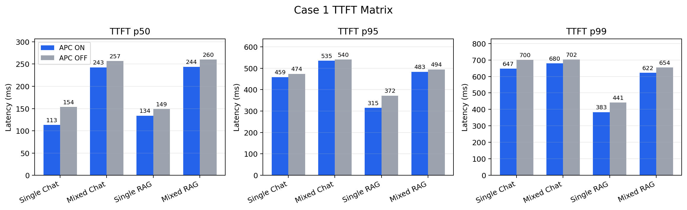
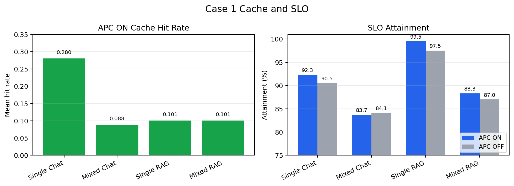
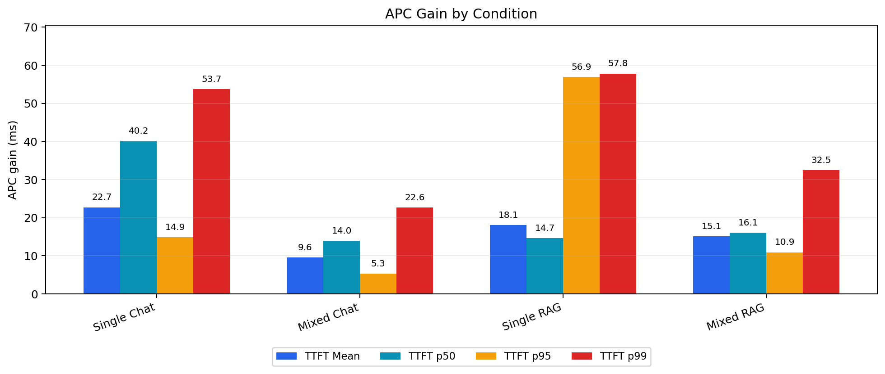
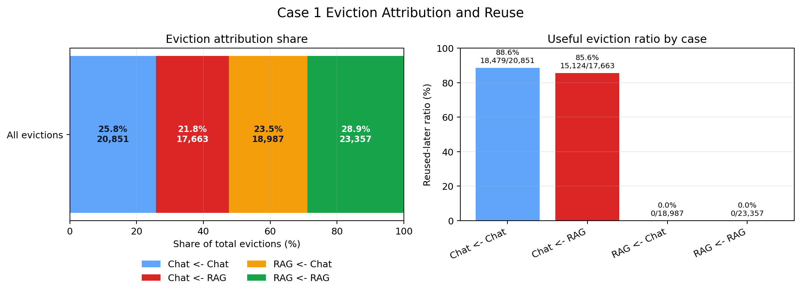
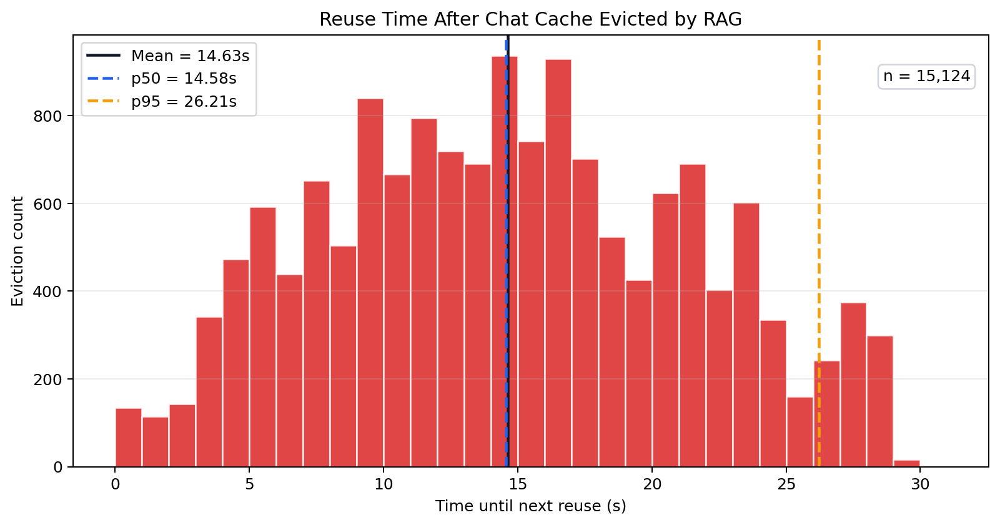

# Case 1 분석

## 1. 분석 목적

`HYPOTHESIS.md`의 Case 1은 single workload와 mixed workload를 각각 APC ON/OFF로 비교해, mixed 환경에서 prefix cache의 이득이 얼마나 유지되는지 확인하는 실험이다.

이 분석은 다음 순서로 진행한다.

1. Chat-only ON/OFF, RAG-only ON/OFF, Mixed ON/OFF를 같은 축에서 비교한다.
2. 각 workload별로 `APC gain = APC OFF - APC ON`을 계산한다.
3. `APC_gain_mixed < APC_gain_single`인지 확인한다.
4. mixed에서 특히 Chat의 `hit_rate`, `TTFT`, `SLO attainment` 변화를 해석한다.
5. eviction log로 `RAG -> Chat` useful eviction이 실제로 있었는지 연결한다.

## 2. 분석 파일 및 실험 조건

상세 내용

아래 파일들은 모두 `hypothesis_validation/case1_validation/raw_results/` 기준이다.

| 조건 | 파일 |
|---|---|
| Chat-only APC ON | `chat_only_apc_on_summary.json` |
| Chat-only APC OFF | `chat_only_apc_off_summary.json` |
| RAG-only APC ON | `rag_only_apc_on_summary.json` |
| RAG-only APC OFF | `rag_only_apc_off_summary.json` |
| Mixed APC ON | `mixed_5_5_apc_on_len8192_summary.json` |
| Mixed APC OFF | `mixed_5_5_apc_off_len8192_summary.json` |
| Mixed APC ON eviction log | `eviction_logs/mixed_apc_on.jsonl` |

현재 실험 조건은 다음과 같다.

- Chat: `100 conversations x 10 turns = 1000 requests`
- RAG: `1000 requests`
- Mixed: `chat_qps=5`, `rag_qps=5`
- SLO: Chat/RAG 모두 `400ms`
- Context: file name 기준 `len8192`
- 모든 summary에서 실패 요청은 `0`

## 3. 전체 결과 표

| Scope | Workload | APC | Hit rate mean | TTFT mean | TTFT p50 | TTFT p95 | TTFT p99 | TPOT mean | SLO attainment |
|---|---|---|---:|---:|---:|---:|---:|---:|---:|
| single | chat | ON | 0.280 | 171.97ms | 113.35ms | 458.96ms | 646.64ms | 35.25ms | 92.3% |
| single | chat | OFF | - | 194.72ms | 153.55ms | 473.85ms | 700.34ms | 37.82ms | 90.5% |
| single | rag | ON | 0.101 | 165.74ms | 134.10ms | 315.08ms | 383.38ms | 29.44ms | 99.5% |
| single | rag | OFF | - | 183.84ms | 148.79ms | 371.97ms | 441.18ms | 32.37ms | 97.5% |
| mixed | chat | ON | 0.088 | 262.13ms | 242.65ms | 535.16ms | 679.79ms | 58.17ms | 83.7% |
| mixed | chat | OFF | - | 271.70ms | 256.63ms | 540.44ms | 702.43ms | 61.19ms | 84.1% |
| mixed | rag | ON | 0.101 | 261.67ms | 243.98ms | 483.38ms | 621.70ms | 60.03ms | 88.3% |
| mixed | rag | OFF | - | 276.80ms | 260.04ms | 494.32ms | 654.23ms | 64.33ms | 87.0% |

*Figure 1. Single/Mixed 조건에서 APC ON/OFF에 따른 TTFT p50, p95, p99 변화를 비교한다.*

*Figure 2. APC ON에서 workload별 cache hit rate를 비교하고, APC ON/OFF별 SLO attainment 변화를 함께 보여준다.*

## 4. APC gain 계산 및 mixed gain 감소 확인

APC gain은 latency metric에 대해 `APC OFF - APC ON`으로 계산한다. 값이 클수록 prefix cache ON이 해당 metric을 더 개선한 것이다.

*Figure 3. Single과 mixed 조건에서 APC gain을 비교한다. 전반적으로 mixed에서는 single 대비 TTFT gain이 감소한다.*

이때 Chat에서 APC gain 감소가 분명하다.

| Metric | Chat-only APC gain | Mixed Chat APC gain | 변화 |
|---|---:|---:|---:|
| TTFT mean | 22.75ms | 9.57ms | -13.18ms |
| TTFT p50 | 40.20ms | 13.98ms | -26.22ms |
| TTFT p95 | 14.89ms | 5.28ms | -9.61ms |
| TTFT p99 | 53.70ms | 22.64ms | -31.06ms |
| SLO attainment | +1.8pp | -0.4pp | -2.2pp |

> [!NOTE]
> Mixed Chat의 SLO gain `-0.4pp`는 APC가 SLO를 악화시켰다는 의미라기보다, mixed에서 APC의 SLO 개선 효과가 거의 사라졌다는 신호로 해석한다.

이 결과는 mixed에서 prefix cache를 켰을 때의 이득이 Chat-only만큼 유지되지 않는다는 방향을 지지한다. 특히 Chat p50 TTFT gain은 `40.20ms -> 13.98ms`로 줄어든다.

따라서 Case 1의 1차 결론은 다음과 같다.

> Mixed workload에서는 APC ON의 이득이 single workload만큼 유지되지 않는다. 특히 Chat에서 APC gain 감소가 뚜렷하다.
> 이는 `HYPOTHESIS.md`의 **5. 비교군 / Case 1**에서 제시한 `APC_gain_mixed < APC_gain_single` 조건을 지지한다.

## 5. Mixed에서 Chat은 어떻게 변했는가?

Chat APC ON 기준으로 single과 mixed를 비교하면 다음과 같다.

| Metric | Chat-only APC ON | Mixed Chat APC ON | 변화 |
|---|---:|---:|---:|
| hit_rate_mean | 0.280 | 0.088 | -68.4% |
| hit_rate_p50 | 0.070 | 0.034 | -51.4% |
| TTFT mean | 171.97ms | 262.13ms | +90.16ms |
| TTFT p50 | 113.35ms | 242.65ms | +129.30ms |
| TTFT p95 | 458.96ms | 535.16ms | +76.21ms |
| SLO attainment | 92.3% | 83.7% | -8.6pp |

이 변화는 가설과 잘 맞는다. Chat은 multi-turn reuse가 있는 workload이므로 single에서는 prefix cache의 이득을 얻는다. 하지만 mixed에서는 Chat hit rate가 크게 떨어지고, TTFT와 SLO가 함께 악화된다.

반면 RAG는 APC ON 기준으로 single과 mixed의 hit rate가 거의 같다.

| Metric | RAG-only APC ON | Mixed RAG APC ON | 변화 |
|---|---:|---:|---:|
| hit_rate_mean | 0.101 | 0.101 | 거의 동일 |
| TTFT mean | 165.74ms | 261.67ms | +95.93ms |
| TTFT p95 | 315.08ms | 483.38ms | +168.30ms |
| SLO attainment | 99.5% | 88.3% | -11.2pp |

즉 mixed는 Chat과 RAG 모두의 serving latency를 악화시킨다. 하지만 cache 관점에서는 두 workload의 양상이 다르다. RAG는 mixed에서 TTFT와 SLO가 악화되지만, hit rate는 single 대비 거의 유지된다. 따라서 RAG의 mixed 손해는 주로 scheduling, batching, prefill/decode interference 같은 serving-level interference에서 온 것으로 해석할 수 있다.

반면 Chat은 mixed에서 TTFT/SLO 악화와 함께 hit rate도 크게 감소한다. 즉 Chat은 일반적인 mixed serving interference뿐 아니라 prefix cache 손실까지 동시에 겪는다. 이 차이는 Case 1에서 중요한데, 모든 workload가 똑같이 cache 손해를 보는 것이 아니라, reuse gap이 긴 Chat이 선택적으로 cache-level degradation을 겪는다는 점을 보여주기 때문이다.

## 6. Eviction attribution과의 연결

현재 Case 1 raw results에는 mixed APC ON 조건의 eviction log가 포함되어 있다.

| 조건 | 파일 |
|---|---|
| Mixed APC ON | `eviction_logs/mixed_apc_on.jsonl` |

이 log의 전체 eviction은 `80,858`건이다. 네 가지 eviction 방향을 한 번에 보면 다음과 같다.

| Case | Count | Share of total | Reused later | Reused ratio | 의미 |
|---|---:|---:|---:|---:|---|
| `chat <- chat` | 20,851 | 25.8% | 18,479 | 88.6% | Chat 요청이 Chat cached block을 밀어냄 |
| `chat <- rag` | 17,663 | 21.8% | 15,124 | 85.6% | RAG 요청이 Chat cached block을 밀어냄 |
| `rag <- chat` | 18,987 | 23.5% | 0 | 0.0% | Chat 요청이 RAG cached block을 밀어냄 |
| `rag <- rag` | 23,357 | 28.9% | 0 | 0.0% | RAG 요청이 RAG cached block을 밀어냄 |

*Figure 4. 전체 eviction 중 각 eviction 방향이 차지하는 비율과, 각 방향별 `reused_later` 비율을 비교한다.*

Chat block eviction은 총 `38,514`건이고, 그중 `17,663`건이 `chat <- rag`이다. 즉 Chat eviction의 `45.9%`가 RAG 요청에 의해 발생했다. 더 중요한 점은 `chat <- rag` eviction 중 `85.6%`가 나중에 다시 재사용되었다는 것이다. 이 block들은 RAG가 밀어내지 않았다면 다음 Chat turn에서 hit 되었을 useful cache였다고 해석할 수 있다.

반대로 `rag <- chat`은 `18,987`건 발생했지만, 이 run에서는 `reused_later=true`가 관측되지 않았다. 즉 cross-workload eviction이 양방향으로 발생하더라도, 모든 eviction이 같은 비용을 갖는 것은 아니다. 현재 결과에서는 **RAG가 Chat을 밀어낸 경우가 useful eviction으로 이어지는 비율이 높고**, Chat이 RAG를 밀어낸 경우는 이후 재사용 손실로 이어진 증거가 없다.

*Figure 5. `chat <- rag`의 `time_until_next_reuse`는 mean `14.63s`, p50 `14.58s`, p95 `26.21s`다. 이는 evict된 Chat block이 수십 초 안에 다시 필요해지는 경우가 많다는 뜻이며, `HYPOTHESIS.md`의 delayed reuse gap 설명과도 맞다.*

따라서 현재 Case 1 결과는 단순히 "Chat hit rate가 mixed에서 낮아졌다"는 상관관계에 그치지 않는다. vLLM eviction log 기준으로도 RAG 요청이 Chat cached block을 직접 evict했고, 그중 다수가 이후 다시 필요해진 useful Chat block이었다.

## 7. 현재 결론

현재 Case 1 결과는 다음 메시지를 지지한다.

1. Single workload에서는 APC ON이 Chat과 RAG 모두에서 TTFT와 SLO를 개선한다.
2. `APC_gain_mixed < APC_gain_single`이며, mixed workload에서는 APC ON의 이득이 single만큼 유지되지 않는다.
3. RAG는 mixed에서 TTFT/SLO가 악화되지만 hit rate는 거의 유지되므로, 주로 serving-level interference를 겪는 것으로 해석된다.
4. Chat은 mixed에서 TTFT/SLO 악화와 함께 `hit_rate_mean`이 `0.280 -> 0.088`로 크게 감소하므로, serving-level interference와 cache-level degradation을 동시에 겪는다.
5. 현재 eviction log는 `RAG -> Chat` useful eviction이 실제로 발생했음을 보여주며, 이는 `HYPOTHESIS.md`의 "reuse gap이 긴 Chat hot cache가 RAG pressure에 의해 LRU 상에서 밀려난다"는 주장과 일관된다.
