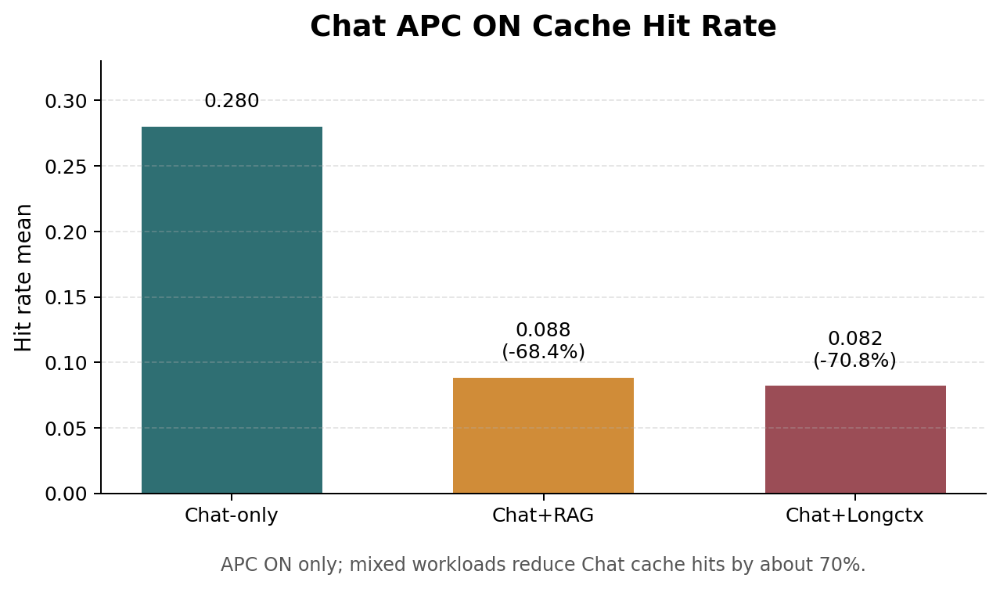
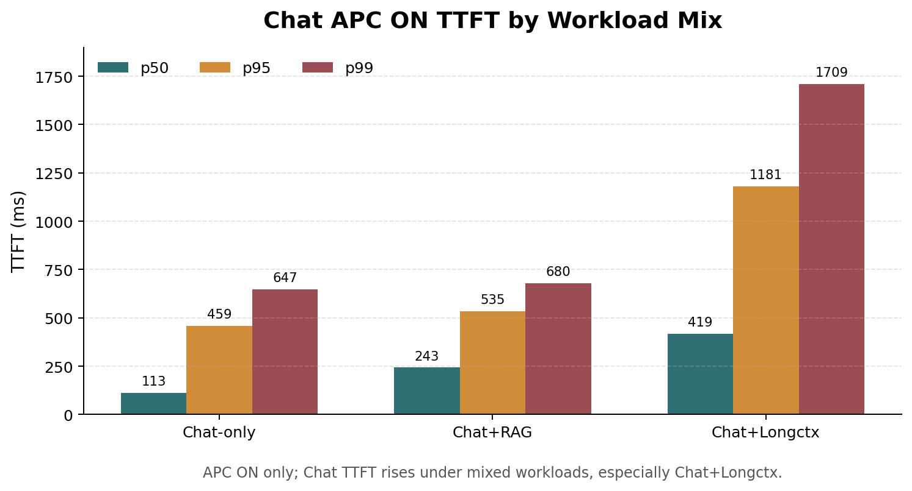
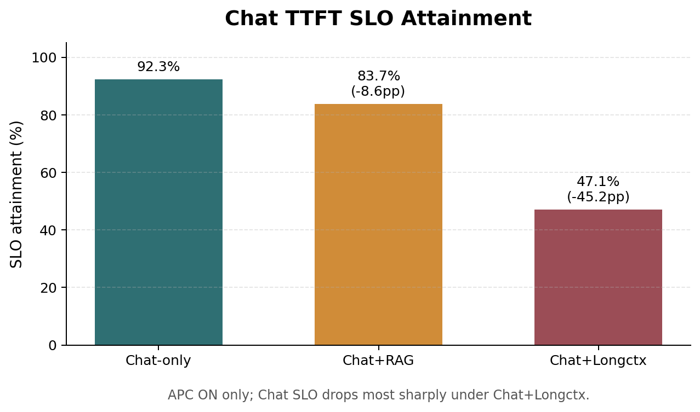
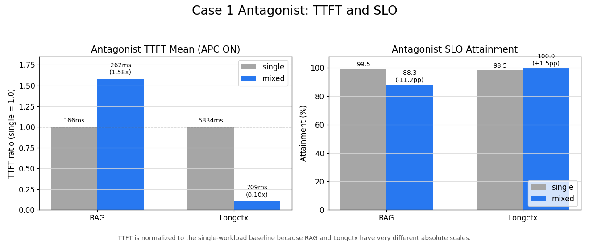
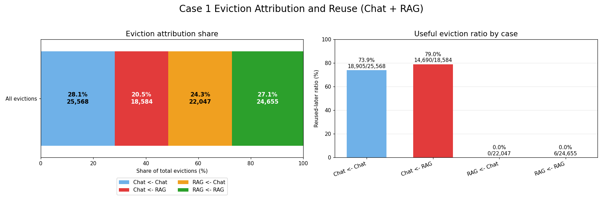
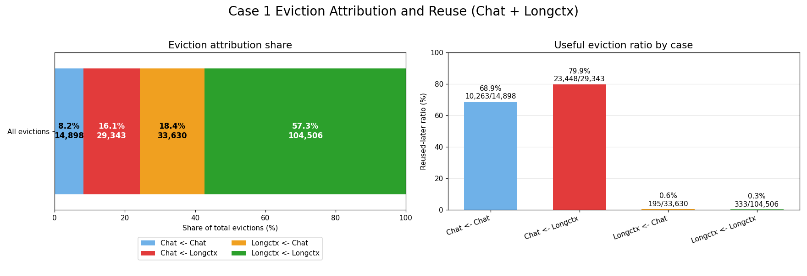
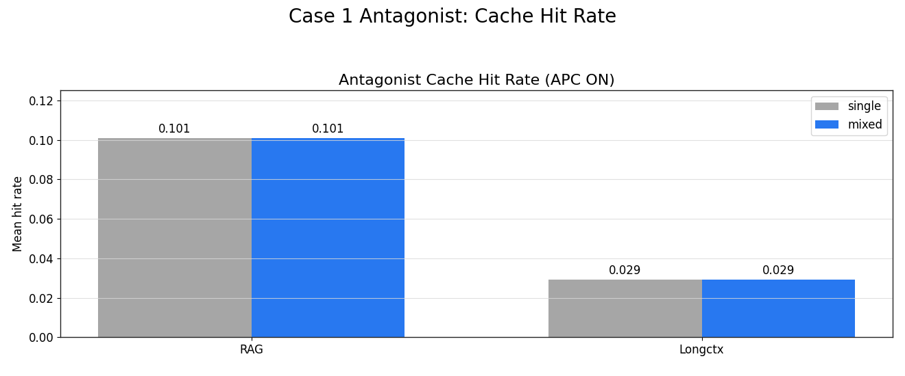
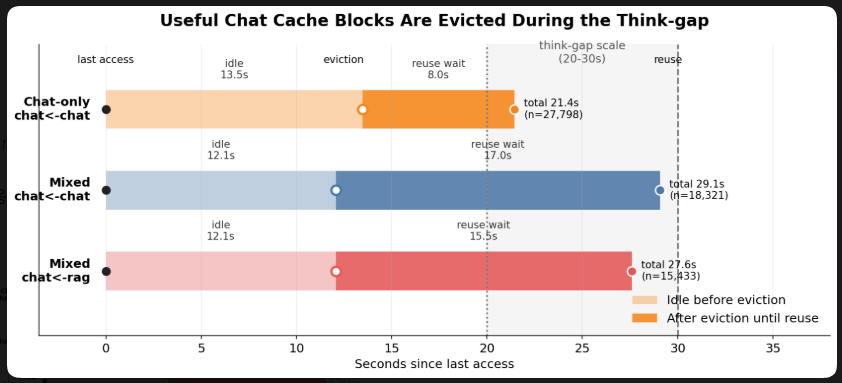
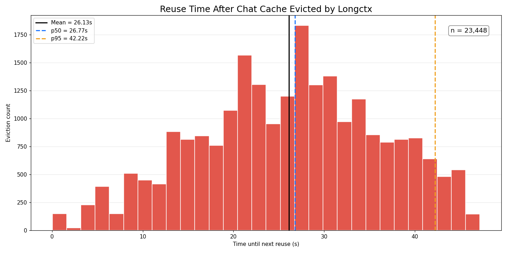

# Case 1 분석

## 1. 분석 목적

`HYPOTHESIS.md`의 Case 1은 single workload와 mixed workload를 각각 APC ON/OFF로 비교해, mixed 환경에서 prefix cache의 이득이 single workload만큼 유지되는지 확인하는 실험이다.

이 문서는 먼저 `HYPOTHESIS.md`의 Case 1 체크리스트에 해당하는 내용만 앞에서 검증한다. 그 범위를 벗어나는 해석, 보조 관찰, 추가 그림은 뒤쪽의 "부가 관찰"로 분리한다.

Case 1에서 먼저 확인할 질문은 다음 다섯 가지다.

1. mixed에서 Chat hit rate가 떨어지는가?
2. mixed에서 Chat TTFT가 증가하는가?
3. mixed에서 Chat SLO attainment가 감소하는가?
4. mixed에서 antagonist(RAG/Longctx)의 TTFT와 SLO attainment는 어떻게 변하는가?
5. mixed에서 RAG보다 cache pressure가 큰 Longctx가 Chat hot cache를 더 많이 직접 evict하는가? 특히 `chat <- longctx` useful eviction이 `chat <- rag`보다 크게 관측되어, antagonist pressure 증가가 Chat hit rate 감소의 cache-level 원인으로 연결되는가?

다만 이 다섯 가지를 보기 전에, Case 1의 분리 측정 기준인 APC gain을 먼저 계산한다.

- `APC_gain_single = single(OFF) - single(ON)`
- `APC_gain_mixed  = mixed(OFF)  - mixed(ON)`
- 같은 workload 조건에서 APC ON/OFF만 바꿔 비교하면 scheduling/batching 효과는 대부분 공통으로 반영되므로, `APC OFF - APC ON`은 해당 조건에서 prefix cache가 제공한 이득을 근사한다.
- `APC_gain_mixed < APC_gain_single`이면, mixed workload에서 prefix cache의 이득이 single workload만큼 유지되지 않는다는 뜻이다.

## 2. 분석 파일 및 실험 조건

상세 내용

아래 파일들은 모두 `hypothesis_validation/case1_validation/raw_results/` 기준이다.

| 조건 | 파일 |
|---|---|
| Chat-only APC ON / OFF | `chat_only_apc_on_summary.json` / `chat_only_apc_off_summary.json` |
| RAG-only APC ON / OFF | `rag_only_apc_on_summary.json` / `rag_only_apc_off_summary.json` |
| Longctx-only APC ON / OFF | `longctx_only_apc_on_summary.json` / `longctx_only_apc_off_summary.json` |
| Chat+RAG mixed APC ON / OFF | `mixed_chat5_rag5_apc_on_len8192_summary.json` / `..._off_...json` |
| Chat+Longctx mixed APC ON / OFF | `mixed_chat5_longctx5_apc_on_len8192_summary.json` / `..._off_...json` |
| Chat+RAG mixed eviction log | `eviction_logs/mixed_chat5_rag5_apc_on_len8192.jsonl` |
| Chat+Longctx mixed eviction log | `eviction_logs/mixed_chat5_longctx5_apc_on_len8192.jsonl` |

현재 실험 조건은 다음과 같다.

- Chat: `100 conversations x 10 turns = 1000 requests`
- RAG: `1000 requests`
- Longctx: `1000 requests` (HotpotQA distractor, 요청당 평균 약 `2.3k` input token)
- Mixed: `chat_qps=5`, antagonist `qps=5`
- SLO: Chat/RAG `400ms`, Longctx `7700ms`
- Context: file name 기준 `len8192`
- 모든 summary에서 실패 요청은 `0`

## 3. 핵심 결과 요약

| 확인 항목 | 관측 결과 | 판단 |
|---|---|---|
| APC gain | Chat p50 TTFT gain이 single `40.20ms`에서 RAG mixed `13.98ms`, Longctx mixed `5.98ms`로 감소 | mixed에서 prefix cache 이득이 유지되지 않음 |
| Chat hit rate | APC ON 기준 single `0.280`에서 RAG mixed `0.088`, Longctx mixed `0.082`로 감소 | mixed에서 Chat cache hit가 크게 감소 |
| Chat TTFT | APC ON 기준 p50 `113.35ms`에서 RAG mixed `242.65ms`, Longctx mixed `419.07ms`로 증가 | mixed에서 Chat TTFT 증가, Longctx mixed가 더 큼 |
| Chat SLO | APC ON 기준 `92.3%`에서 RAG mixed `83.7%`, Longctx mixed `47.1%`로 감소 | mixed에서 Chat SLO 감소, Longctx mixed가 더 큼 |
| Antagonist TTFT/SLO | RAG는 mixed에서 TTFT 증가와 SLO 감소, Longctx는 현재 조건에서 SLO 유지 | Chat 손해와 antagonist 손해가 대칭적이지 않음 |
| Useful eviction | `chat <- rag` useful eviction `14,690`, `chat <- longctx` useful eviction `23,448` | Longctx가 RAG보다 Chat hot cache를 더 많이 밀어냄 |

## 4. APC gain 확인

APC gain은 latency metric에 대해 `APC OFF - APC ON`으로 계산한다. 값이 클수록 prefix cache ON이 해당 metric을 더 개선한 것이다.

*Figure 1. Chat의 조건별 APC gain. p50 gain이 `Chat single 40.20ms -> Chat+RAG 13.98ms -> Chat+Longctx 5.98ms`로 줄어든다.*

| Metric | Chat-only APC gain | Mixed Chat (RAG) | Mixed Chat (Longctx) |
|---|---:|---:|---:|
| TTFT mean | 22.75ms | 9.57ms | 17.43ms |
| TTFT p50 | 40.20ms | 13.98ms | 5.98ms |
| TTFT p95 | 14.89ms | 5.28ms | 11.98ms |
| TTFT p99 | 53.70ms | 22.64ms | 95.73ms |
| SLO attainment | +1.8pp | -0.4pp | +0.7pp |

가장 안정적인 신호는 p50 TTFT gain이다. Chat-only에서는 APC가 p50 TTFT를 `40.20ms` 줄였지만, RAG mixed에서는 `13.98ms`, Longctx mixed에서는 `5.98ms`만 줄였다. 따라서 `APC_gain_mixed < APC_gain_single` 조건은 RAG와 Longctx 두 antagonist 모두에서 관측된다.

> [!NOTE]
> Mixed Chat+Longctx의 TTFT p99 gain(`95.73ms`)은 single(`53.70ms`)보다 커 보인다. 하지만 heavy mixed 조건의 p99 tail은 변동성이 크므로, APC gain 감소 판단은 p50과 mean을 중심으로 본다.

## 5. 확인 1: mixed에서 Chat hit rate가 떨어지는가?

APC ON 기준으로 Chat hit rate는 single 대비 mixed에서 크게 감소한다.

*Figure 2. Chat의 APC ON cache hit rate. single `0.280`에서 RAG/Longctx mixed 모두 약 `0.08` 수준으로 떨어진다.*

| 조건 | Chat hit_rate_mean | single 대비 변화 |
|---|---:|---:|
| Chat-only | 0.280 | 기준 |
| Chat + RAG | 0.088 | -68.4% |
| Chat + Longctx | 0.082 | -70.7% |

결론은 명확하다. mixed에서는 Chat hit rate가 single 대비 약 `70%` 감소한다.

다만 RAG mixed와 Longctx mixed의 hit rate 차이는 `0.088` 대 `0.082`로 크지 않다. 따라서 현재 데이터만으로 "Longctx가 RAG보다 Chat hit rate를 훨씬 더 낮춘다"고 말하기보다는, "RAG와 Longctx 모두 Chat hit rate를 크게 낮추며, Longctx는 뒤에서 보듯 useful eviction과 serving 손해를 더 크게 만든다"고 해석하는 편이 정확하다.

## 6. 확인 2: mixed에서 Chat TTFT가 증가하는가?

APC ON 기준으로 Chat TTFT는 mixed에서 증가한다. 특히 Longctx와 섞였을 때 증가 폭이 크다.

*Figure 3. Chat의 APC ON TTFT p50/p95/p99를 `Chat single`, `Chat + RAG`, `Chat + Longctx` 세 조건에서 비교한다.*

| 조건 | TTFT mean | TTFT p50 | TTFT p95 | TTFT p99 |
|---|---:|---:|---:|---:|
| Chat-only | 171.97ms | 113.35ms | 458.96ms | 646.64ms |
| Chat + RAG | 262.13ms | 242.65ms | 535.16ms | 679.79ms |
| Chat + Longctx | 486.38ms | 419.07ms | 1181.39ms | 1708.61ms |

Chat p50 TTFT는 single `113.35ms`에서 RAG mixed `242.65ms`, Longctx mixed `419.07ms`로 증가한다. p95와 p99에서도 Longctx mixed가 가장 나쁘다.

## 7. 확인 3: mixed에서 Chat SLO attainment가 감소하는가?

APC ON 기준으로 Chat SLO attainment는 mixed에서 감소한다.

*Figure 4. Chat의 APC ON TTFT SLO attainment. single `92.3%`에서 RAG mixed `83.7%`, Longctx mixed `47.1%`로 감소한다.*

| 조건 | Chat SLO attainment | single 대비 변화 |
|---|---:|---:|
| Chat-only | 92.3% | 기준 |
| Chat + RAG | 83.7% | -8.6pp |
| Chat + Longctx | 47.1% | -45.2pp |

Chat SLO는 RAG mixed에서 `83.7%`로 낮아지고, Longctx mixed에서는 `47.1%`까지 떨어진다. 즉 mixed에서 Chat의 user-facing 품질 손해가 관측되며, Longctx mixed에서 그 손해가 훨씬 크다.

## 8. 확인 4: mixed에서 antagonist의 TTFT와 SLO attainment는 어떻게 변하는가?

아래 표는 APC ON 기준으로 antagonist 자신을 single과 mixed에서 비교한 것이다.

*Figure 5. antagonist(RAG/Longctx)의 APC ON single vs mixed. TTFT는 RAG와 Longctx의 절대 스케일 차이가 커서 single=1.0 기준 비율로 표시하고, 막대 라벨에 실제 mean TTFT를 함께 적었다.*

| Antagonist | 조건 | TTFT mean | TTFT p50 | TTFT p95 | SLO attainment |
|---|---|---:|---:|---:|---:|
| RAG | RAG-only | 165.74ms | 134.10ms | 315.08ms | 99.5% |
| RAG | Chat + RAG | 261.67ms | 243.98ms | 483.38ms | 88.3% |
| Longctx | Longctx-only | 6834.32ms | 7181.79ms | 7646.69ms | 98.5% |
| Longctx | Chat + Longctx | 708.55ms | 654.87ms | 1353.74ms | 100.0% |

RAG는 mixed에서 TTFT가 증가하고 SLO가 `99.5% -> 88.3%`로 감소한다. 반면 Longctx는 현재 조건에서 mixed SLO가 `100.0%`로 유지된다.

따라서 Case 1의 관측은 "mixed에서 모든 workload가 같은 방식으로 손해를 본다"가 아니다. turn 간 reuse gap이 존재하는 Chat은 hit rate, TTFT, SLO가 모두 악화되지만, antagonist의 손해는 workload별로 다르게 나타난다.

## 9. 확인 5: RAG보다 pressure가 큰 Longctx가 Chat hot cache를 더 많이 직접 evict하는가?

raw results에는 두 mixed 조건의 eviction log가 모두 포함되어 있다.

| 조건 | 전체 eviction |
|---|---:|
| Chat+RAG mixed APC ON | 90,854 |
| Chat+Longctx mixed APC ON | 182,377 |

Longctx mixed의 전체 eviction은 RAG mixed의 약 `2.01x`다. 이는 Longctx가 RAG보다 cache pressure가 큰 antagonist라는 실험 의도와 맞는다.

핵심은 전체 eviction이 아니라, antagonist가 Chat block을 직접 밀어낸 사건 중 이후 다시 필요해진 useful eviction이다.

| 조건 | Chat block eviction | `chat <- antagonist` count | Chat eviction 중 비율 | Useful count | Useful ratio |
|---|---:|---:|---:|---:|---:|
| Chat + RAG | 44,152 | 18,584 | 42.1% | 14,690 | 79.0% |
| Chat + Longctx | 44,241 | 29,343 | 66.3% | 23,448 | 79.9% |

*Figure 6. Chat+RAG: 전체 eviction 중 각 방향의 비율과 `reused_later` 비율.*

*Figure 7. Chat+Longctx: 전체 eviction의 방향별 비율과 `reused_later` 비율.*

Longctx는 RAG보다 Chat block을 직접 evict한 횟수가 많다.

- `chat <- rag`: `18,584`건, Chat eviction 중 `42.1%`
- `chat <- longctx`: `29,343`건, Chat eviction 중 `66.3%` (`1.58x`)

그중 이후 다시 쓰인 `reused_later` 비율은 두 조건 모두 약 `80%`로 높다.

- `chat <- rag`: useful eviction `14,690`건, useful ratio `79.0%`
- `chat <- longctx`: useful eviction `23,448`건, useful ratio `79.9%` (`1.60x`)

즉 RAG보다 cache pressure가 큰 Longctx는 Chat hot cache를 더 많이 직접 밀어낸다. 동시에 `reused_later` 비율도 RAG와 비슷하게 높은 `79.9%`라서, Longctx가 더 많이 밀어낸 block의 대부분은 이후 다시 필요해진 useful cache다. 이는 "Longctx가 Chat hit rate 감소의 cache-level 원인 중 하나로 연결된다"는 설명을 eviction attribution으로 뒷받침한다.

다만 5절에서 보았듯, Chat hit rate 자체는 RAG mixed `0.088`, Longctx mixed `0.082`로 차이가 작다. 따라서 현재 결과의 정확한 표현은 다음과 같다.

> RAG와 Longctx 모두 mixed에서 Chat hit rate를 크게 낮춘다. 그중 Longctx는 RAG보다 `chat <- antagonist` useful eviction을 더 많이 만들고, Chat의 TTFT/SLO 손해도 훨씬 크게 만든다.

## 10. 1차 결론

Case 1의 핵심 체크리스트 기준으로는 다음 결론을 낼 수 있다.

1. Mixed workload에서는 Chat의 APC gain이 single workload만큼 유지되지 않는다. Chat p50 TTFT gain은 single `40.20ms`에서 RAG mixed `13.98ms`, Longctx mixed `5.98ms`로 감소한다.
2. Mixed workload에서는 Chat hit rate가 single 대비 약 `70%` 감소한다.
3. Mixed workload에서는 Chat TTFT가 증가하고 SLO attainment가 감소한다. 특히 Longctx mixed에서 Chat SLO는 `47.1%`까지 떨어진다.
4. Antagonist 자신의 손해는 Chat과 대칭적이지 않다. RAG는 mixed에서 SLO가 떨어지지만, Longctx는 현재 조건에서 SLO를 유지한다.
5. RAG보다 cache pressure가 큰 Longctx는 `chat <- antagonist` useful eviction을 더 많이 만든다. `chat <- longctx` useful eviction은 `23,448`건으로, `chat <- rag` useful eviction `14,690`건의 `1.60x`다.

따라서 Case 1은 `HYPOTHESIS.md`의 핵심 주장, 즉 mixed workload에서 prefix cache 이득이 약해지고, RAG보다 큰 pressure를 주는 Longctx가 Chat hot cache useful eviction을 더 강하게 유발한다는 설명을 지지한다.

## 11. 부가 관찰

이 절은 앞의 핵심 체크리스트를 벗어나지만, 결과 해석에 도움이 되는 관찰을 모아 둔다.

### 11.1 전체 결과 표

전체 결과 표 보기

`mixed (rag)`는 Chat+RAG mixed, `mixed (lc)`는 Chat+Longctx mixed를 뜻한다.

| Scope | Workload | APC | Hit rate mean | TTFT mean | TTFT p50 | TTFT p95 | TTFT p99 | TPOT mean | SLO attainment |
|---|---|---|---:|---:|---:|---:|---:|---:|---:|
| single | chat | ON | 0.280 | 171.97ms | 113.35ms | 458.96ms | 646.64ms | 35.25ms | 92.3% |
| single | chat | OFF | - | 194.72ms | 153.55ms | 473.85ms | 700.34ms | 37.82ms | 90.5% |
| single | rag | ON | 0.101 | 165.74ms | 134.10ms | 315.08ms | 383.38ms | 29.44ms | 99.5% |
| single | rag | OFF | - | 183.84ms | 148.79ms | 371.97ms | 441.18ms | 32.37ms | 97.5% |
| single | longctx | ON | 0.029 | 6834.32ms | 7181.79ms | 7646.69ms | 7876.36ms | 223.39ms | 98.5% |
| single | longctx | OFF | - | 7057.22ms | 7394.97ms | 7856.66ms | 8091.06ms | 223.12ms | 90.9% |
| mixed (rag) | chat | ON | 0.088 | 262.13ms | 242.65ms | 535.16ms | 679.79ms | 58.17ms | 83.7% |
| mixed (rag) | chat | OFF | - | 271.70ms | 256.63ms | 540.44ms | 702.43ms | 61.19ms | 84.1% |
| mixed (rag) | rag | ON | 0.101 | 261.67ms | 243.98ms | 483.38ms | 621.70ms | 60.03ms | 88.3% |
| mixed (rag) | rag | OFF | - | 276.80ms | 260.04ms | 494.32ms | 654.23ms | 64.33ms | 87.0% |
| mixed (lc) | chat | ON | 0.082 | 486.38ms | 419.07ms | 1181.39ms | 1708.61ms | 110.95ms | 47.1% |
| mixed (lc) | chat | OFF | - | 503.81ms | 425.05ms | 1193.37ms | 1804.34ms | 113.53ms | 46.4% |
| mixed (lc) | longctx | ON | 0.029 | 708.55ms | 654.87ms | 1353.74ms | 1695.89ms | 132.25ms | 100.0% |
| mixed (lc) | longctx | OFF | - | 740.25ms | 690.55ms | 1363.54ms | 1894.59ms | 137.80ms | 100.0% |

### 11.2 Antagonist의 hit rate는 거의 유지된다

Chat과 달리, antagonist(RAG/Longctx) 자신은 mixed에서 cache hit rate가 거의 변하지 않는다.

| Metric | RAG-only | Mixed RAG | Longctx-only | Mixed Longctx |
|---|---:|---:|---:|---:|
| hit_rate_mean | 0.101 | 0.101 | 0.029 | 0.029 |

*Figure 8. antagonist(RAG/Longctx) 자신의 single vs mixed. hit rate는 single에서 mixed로 가도 사실상 변하지 않는다.*

이 관찰은 cache 손해가 모든 workload에 똑같이 나타나는 것이 아니라, reuse gap이 긴 Chat에 더 크게 나타난다는 해석을 보조한다.

### 11.3 Longctx mixed의 serving-level 손해

Chat hit rate 감소 폭은 RAG mixed와 Longctx mixed가 비슷하다. 하지만 Chat TTFT와 SLO 손해는 Longctx mixed에서 훨씬 크다.

이는 Longctx의 대용량 prefill이 batch를 점유해 prefill/decode interference를 강하게 일으키기 때문으로 해석할 수 있다. 즉 Longctx mixed의 Chat 손해에는 cache-level degradation과 serving-level interference가 함께 섞여 있다.

### 11.4 Longctx의 self-churn

Longctx mixed에서는 전체 eviction의 `57.3%`가 `longctx <- longctx`다. 이 방향의 재사용률은 `0.3%`로 사실상 0에 가깝다.

| Case | Count | Share | Reused later | Reused ratio |
|---|---:|---:|---:|---:|
| `chat <- chat` | 14,898 | 8.2% | 10,263 | 68.9% |
| `chat <- longctx` | 29,343 | 16.1% | 23,448 | 79.9% |
| `longctx <- chat` | 33,630 | 18.4% | 195 | 0.6% |
| `longctx <- longctx` | 104,506 | 57.3% | 333 | 0.3% |

이는 Longctx가 대용량 low-reuse prompt로 신규 block을 많이 만들고, 그중 상당수는 다시 쓰이지 않는다는 점을 보여준다.

### 11.5 Evicted Chat block의 재사용 시간

*Figure 9. useful Chat cache block이 마지막 접근 이후 eviction되고, 이후 다시 reuse되기까지의 시간 구조. mixed의 `chat <- chat`, `chat <- rag` 모두 eviction 이후 reuse까지의 전체 시간이 Chat think-gap scale(`20-30s`)에 들어온다.*

*Figure 10. `chat <- longctx`의 `time_until_next_reuse`는 mean `26.13s`, p50 `26.77s`, p95 `42.22s`다.*

Figure 9는 useful Chat block이 think-gap 중간에 evict되고, 같은 think-gap 안에서 다시 필요해지는 구조를 보여준다. Figure 10은 그중 `chat <- longctx`에 초점을 맞춘 reuse wait 분포다. `time_until_next_reuse`는 evict된 Chat cache가 다시 필요해진 시점까지의 시간이며, Longctx가 밀어낸 Chat block은 수십 초 뒤 다음 turn에서 다시 필요해진다. 이는 `HYPOTHESIS.md` 2절의 reuse 시간 척도 불일치 설명과 일치한다.
