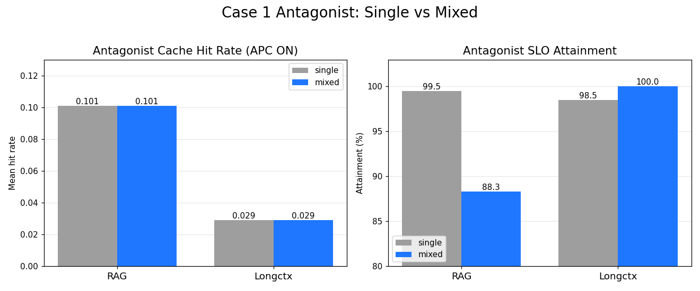
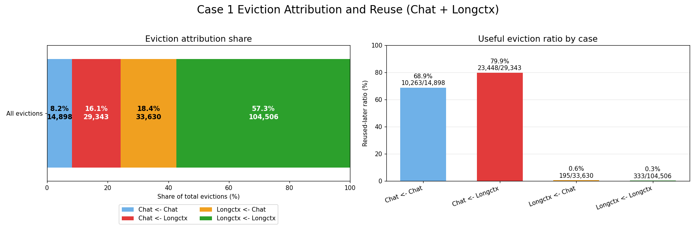

# Case 1 분석

## 1. 분석 목적

`HYPOTHESIS.md`의 Case 1은 single workload와 mixed workload를 각각 APC ON/OFF로 비교해, mixed 환경에서 prefix cache의 이득이 얼마나 유지되는지 확인하는 실험이다. antagonist는 두 가지를 쓴다. **RAG**(현실적 prefill-heavy baseline)와 **Longctx**(HotpotQA 기반 대용량 low-reuse antagonist, `HYPOTHESIS.md` 8절). Longctx는 RAG보다 강한 antagonist로 두고 Chat hot cache eviction 메커니즘을 더 세게 자극한다.

이 분석은 다음 순서로 진행한다.

1. Chat-only, RAG-only, Longctx-only, Chat+RAG mixed, Chat+Longctx mixed를 같은 축에서 비교한다 (각각 APC ON/OFF).
2. 각 조건별로 `APC gain = APC OFF - APC ON`을 계산한다.
3. `APC_gain_mixed < APC_gain_single`인지 확인한다.
4. mixed에서 특히 Chat의 `hit_rate`, `TTFT`, `SLO attainment` 변화를 해석하고, **RAG antagonist와 Longctx antagonist를 대조**한다.
5. eviction log로 `RAG -> Chat`, `Longctx -> Chat` useful eviction이 실제로 있었는지 연결한다.

## 2. 분석 파일 및 실험 조건

상세 내용

아래 파일들은 모두 `hypothesis_validation/case1_validation/raw_results/` 기준이다.

| 조건 | 파일 |
|---|---|
| Chat-only APC ON / OFF | `chat_only_apc_on_summary.json` / `chat_only_apc_off_summary.json` |
| RAG-only APC ON / OFF | `rag_only_apc_on_summary.json` / `rag_only_apc_off_summary.json` |
| Longctx-only APC ON / OFF | `longctx_only_apc_on_summary.json` / `longctx_only_apc_off_summary.json` |
| Chat+RAG mixed APC ON / OFF | `mixed_chat5_rag5_apc_on_len8192_summary.json` / `..._off_...json` |
| Chat+Longctx mixed APC ON / OFF | `mixed_chat5_longctx5_apc_on_len8192_summary.json` / `..._off_...json` |
| Chat+RAG mixed eviction log | `eviction_logs/mixed_chat5_rag5_apc_on_len8192.jsonl` |
| Chat+Longctx mixed eviction log | `eviction_logs/mixed_chat5_longctx5_apc_on_len8192.jsonl` |

현재 실험 조건은 다음과 같다.

- Chat: `100 conversations x 10 turns = 1000 requests`
- RAG: `1000 requests`
- Longctx: `1000 requests` (HotpotQA distractor, 요청당 평균 ~2.3k input token)
- Mixed: `chat_qps=5`, antagonist `qps=5`
- SLO: Chat/RAG `400ms`, Longctx `7700ms`
- Context: file name 기준 `len8192`
- 모든 summary에서 실패 요청은 `0`

## 3. 전체 결과 표

`mixed (rag)`는 Chat+RAG mixed, `mixed (lc)`는 Chat+Longctx mixed를 뜻한다.

| Scope | Workload | APC | Hit rate mean | TTFT mean | TTFT p50 | TTFT p95 | TTFT p99 | TPOT mean | SLO attainment |
|---|---|---|---:|---:|---:|---:|---:|---:|---:|
| single | chat | ON | 0.280 | 171.97ms | 113.35ms | 458.96ms | 646.64ms | 35.25ms | 92.3% |
| single | chat | OFF | - | 194.72ms | 153.55ms | 473.85ms | 700.34ms | 37.82ms | 90.5% |
| single | rag | ON | 0.101 | 165.74ms | 134.10ms | 315.08ms | 383.38ms | 29.44ms | 99.5% |
| single | rag | OFF | - | 183.84ms | 148.79ms | 371.97ms | 441.18ms | 32.37ms | 97.5% |
| single | longctx | ON | 0.029 | 6834.32ms | 7181.79ms | 7646.69ms | 7876.36ms | 223.39ms | 98.5% |
| single | longctx | OFF | - | 7057.22ms | 7394.97ms | 7856.66ms | 8091.06ms | 223.12ms | 90.9% |
| mixed (rag) | chat | ON | 0.088 | 262.13ms | 242.65ms | 535.16ms | 679.79ms | 58.17ms | 83.7% |
| mixed (rag) | chat | OFF | - | 271.70ms | 256.63ms | 540.44ms | 702.43ms | 61.19ms | 84.1% |
| mixed (rag) | rag | ON | 0.101 | 261.67ms | 243.98ms | 483.38ms | 621.70ms | 60.03ms | 88.3% |
| mixed (rag) | rag | OFF | - | 276.80ms | 260.04ms | 494.32ms | 654.23ms | 64.33ms | 87.0% |
| mixed (lc) | chat | ON | 0.082 | 486.38ms | 419.07ms | 1181.39ms | 1708.61ms | 110.95ms | 47.1% |
| mixed (lc) | chat | OFF | - | 503.81ms | 425.05ms | 1193.37ms | 1804.34ms | 113.53ms | 46.4% |
| mixed (lc) | longctx | ON | 0.029 | 708.55ms | 654.87ms | 1353.74ms | 1695.89ms | 132.25ms | 100.0% |
| mixed (lc) | longctx | OFF | - | 740.25ms | 690.55ms | 1363.54ms | 1894.59ms | 137.80ms | 100.0% |

*Figure 1. Chat의 TTFT p50/p95/p99를 `Chat single` / `Chat + RAG` / `Chat + Longctx` 세 조건에서 APC ON/OFF로 비교한다. Longctx와 섞인 Chat은 RAG와 섞인 Chat보다 TTFT가 훨씬 높다(p50 `419` vs `243`, p99 `1709` vs `680`).*

*Figure 2. (좌) Chat의 APC ON cache hit rate. single `0.280`에서 RAG/Longctx mix 모두 `~0.08`로 떨어진다. (우) Chat SLO attainment. **Chat+Longctx의 Chat SLO는 `47.1%`로 급락**해 RAG mix(`83.7%`)보다 훨씬 나쁘다.*

## 4. APC gain 계산 및 mixed gain 감소 확인

APC gain은 latency metric에 대해 `APC OFF - APC ON`으로 계산한다. 값이 클수록 prefix cache ON이 해당 metric을 더 개선한 것이다.

*Figure 3. Chat의 조건별 APC gain. p50 gain이 `Chat single 40.2 → +RAG 14.0 → +Longctx 6.0`으로 줄어든다.*

### 4.1 Chat의 APC gain 감소 (RAG / Longctx 공통)

Chat은 두 antagonist 모두에서 single 대비 APC gain이 줄어든다.

| Metric | Chat-only APC gain | Mixed Chat (RAG) | Mixed Chat (LC) |
|---|---:|---:|---:|
| TTFT mean | 22.75ms | 9.57ms | 17.43ms |
| TTFT p50 | 40.20ms | 13.98ms | 5.98ms |
| TTFT p95 | 14.89ms | 5.28ms | 11.98ms |
| TTFT p99 | 53.70ms | 22.64ms | 95.73ms |
| SLO attainment | +1.8pp | -0.4pp | +0.7pp |

p50 TTFT gain은 가장 깨끗한 신호다. Chat-only `40.20ms`에서 Mixed Chat·RAG `13.98ms`, Mixed Chat·LC `5.98ms`로, **Longctx와 섞였을 때 p50 cache 이득이 거의 사라진다.** SLO 측면에서도 APC가 single에서 만들던 `+1.8pp` 개선이 mixed에서 `±0.5pp` 수준으로 사라진다.

> [!NOTE]
> Mixed Chat·LC의 TTFT p99 gain(`95.73ms`)이 single(`53.70ms`)보다 커 보이는 것은 p99 tail이 heavy mix에서 noisy하기 때문이다. 부하가 큰 조건일수록 tail은 변동이 크므로, gain 감소 판단은 p50/mean 중심으로 본다.

### 4.2 1차 결론

> Mixed workload에서는 APC ON의 이득이 single workload만큼 유지되지 않는다. 특히 Chat의 p50 TTFT gain이 `40.20ms → 5.98ms`(Longctx mix)로 거의 소멸한다.
> 이는 `HYPOTHESIS.md`의 **5. 비교군 / Case 1**에서 제시한 `APC_gain_mixed < APC_gain_single` 조건을 RAG와 Longctx 두 antagonist 모두에서 지지한다.

## 5. Mixed에서 무엇이 변했는가? — Chat 손해와 antagonist 비대칭

4절은 cache가 주는 *이득(APC gain)*이 mixed에서 줄어든다는 것을 봤다. 여기서는 그 결과로 **Chat 자체가 무엇을 잃는지(hit rate)** 와, **antagonist에 따라 손해 양상이 어떻게 다른지**를 본다. 비교는 모두 APC ON 기준이다.

### 5.1 Chat: RAG와 섞일 때 vs Longctx와 섞일 때

Chat APC ON 기준으로 single과 두 mixed를 비교한다.

| Metric | Chat-only | Chat + RAG | Chat + Longctx |
|---|---:|---:|---:|
| hit_rate_mean | 0.280 | 0.088 (-68.4%) | 0.082 (-70.7%) |
| hit_rate_p50 | 0.070 | 0.034 | 0.032 |
| TTFT mean | 171.97ms | 262.13ms | 486.38ms |
| TTFT p50 | 113.35ms | 242.65ms | 419.07ms |
| TTFT p95 | 458.96ms | 535.16ms | 1181.39ms |
| TPOT mean | 35.25ms | 58.17ms | 110.95ms |
| SLO attainment | 92.3% | 83.7% (-8.6pp) | 47.1% (-45.2pp) |

여기서 두 가지를 읽을 수 있다.

**(1) Cache 손해의 크기는 RAG와 Longctx가 비슷하다.** Chat hit rate는 RAG mixed `0.088`, Longctx mixed `0.082`로 둘 다 single 대비 ~70% 떨어진다. 즉 cache hit 자체의 degradation 폭은 두 antagonist가 유사하다.

**(2) Serving 손해의 크기는 Longctx가 훨씬 크다.** Chat SLO는 RAG mixed에서 `83.7%`로 떨어지는 데 그치지만, Longctx mixed에서는 `47.1%`로 급락한다(-45.2pp). TTFT mean도 `262ms` vs `486ms`, TPOT도 `58ms` vs `111ms`로 Longctx 쪽이 훨씬 나쁘다. 이는 Longctx의 대용량 prefill이 batch를 점유해 prefill/decode interference를 강하게 일으키기 때문으로 해석된다(`HYPOTHESIS.md` 6.2의 간접 경로).

### 5.2 antagonist 자신은 cache 관점에서 양상이 다르다

Chat과 달리, antagonist(RAG/Longctx) 자신은 mixed에서 cache 손해가 거의 없다.

| Metric | RAG-only | Mixed RAG | Longctx-only | Mixed Longctx |
|---|---:|---:|---:|---:|
| hit_rate_mean | 0.101 | 0.101 | 0.029 | 0.029 |
| SLO attainment | 99.5% | 88.3% | 98.5% | 100.0% |

RAG와 Longctx 모두 mixed에서 hit rate가 거의 변하지 않는다(원래 reuse가 낮은 workload).
이 대조가 Case 1의 핵심이다. 모든 workload가 똑같이 손해를 보는 것이 아니라, **reuse gap이 긴 Chat이 선택적으로 cache-level degradation을 겪고**, antagonist가 강할수록(Longctx) 그 위에 serving-level interference까지 겹친다.

*Figure 4. antagonist(RAG/Longctx) 자신의 single vs mixed. (좌) hit rate는 single→mixed에서 사실상 변하지 않는다(RAG `0.101`, Longctx `0.029` 고정) — antagonist는 cache 손해가 없다. (우) SLO는 RAG가 `99.5→88.3`으로 다소 떨어지지만 **Longctx는 mixed에서도 `100%`** 를 유지한다. 즉 antagonist의 손해는 Chat보다 훨씬 작고(Longctx는 사실상 0), 이는 5.1의 Chat 붕괴(hit rate ~70%↓, SLO `47.1%`)와 대비되어 손해가 Chat에 비대칭적으로 쏠린다는 것을 보여준다.*

## 6. Eviction attribution과의 연결

raw results에는 두 mixed 조건의 eviction log가 모두 포함되어 있다.

| 조건 | 파일 | 전체 eviction |
|---|---|---:|
| Chat+RAG mixed APC ON | `eviction_logs/mixed_chat5_rag5_apc_on_len8192.jsonl` | 90,854 |
| Chat+Longctx mixed APC ON | `eviction_logs/mixed_chat5_longctx5_apc_on_len8192.jsonl` | 182,377 |

먼저, Longctx mixed의 전체 eviction(`182,377`)은 RAG mixed(`90,854`)의 약 **2배**다. Longctx가 대용량 low-reuse prompt로 신규 block을 훨씬 많이 생산해 cache pool을 강하게 휘젓는다는 증거다.

### 6.1 Chat+RAG mixed

| Case | Count | Share | Reused later | Reused ratio |
|---|---:|---:|---:|---:|
| `chat <- chat` | 25,568 | 28.1% | 18,905 | 73.9% |
| `chat <- rag` | 18,584 | 20.5% | 14,690 | 79.0% |
| `rag <- chat` | 22,047 | 24.3% | 0 | 0.0% |
| `rag <- rag` | 24,655 | 27.1% | 6 | 0.0% |

*Figure 5. Chat+RAG: 전체 eviction 중 각 방향의 비율과 `reused_later` 비율.*

Chat block eviction은 총 `44,152`건이고 그중 `18,584`건(`42.1%`)이 `chat <- rag`다. 이 중 `79.0%`가 이후 재사용되었다 — RAG가 밀어내지 않았다면 다음 Chat turn에서 hit 되었을 useful cache다.

### 6.2 Chat+Longctx mixed

| Case | Count | Share | Reused later | Reused ratio |
|---|---:|---:|---:|---:|
| `chat <- chat` | 14,898 | 8.2% | 10,263 | 68.9% |
| `chat <- longctx` | 29,343 | 16.1% | 23,448 | 79.9% |
| `longctx <- chat` | 33,630 | 18.4% | 195 | 0.6% |
| `longctx <- longctx` | 104,506 | 57.3% | 333 | 0.3% |

*Figure 6. Chat+Longctx: 전체 eviction의 `57.3%`가 `longctx <- longctx`(대용량 low-reuse block의 self-churn, 재사용 `0.3%`)다. Chat이 밀려난 경우(`chat <- longctx`)는 `79.9%`가 이후 재사용된다.*

여기서 두 가지가 RAG보다 강하게 나타난다.

- **Chat eviction에서 antagonist 기여 비중이 더 크다.** Chat block eviction은 총 `44,241`건이고 그중 `29,343`건이 `chat <- longctx`다. 즉 Chat eviction의 **`66.3%`가 Longctx 요청에 의해 발생**했다(RAG는 `42.1%`였다). Longctx가 Chat hot cache를 밀어내는 직접 가해자 역할을 RAG보다 훨씬 강하게 한다.
- **`chat <- longctx`의 useful eviction 비율은 `79.9%`로 높다.** 밀려난 Chat block의 약 80%가 이후 다시 필요해졌다 — 곧 재사용될 hot cache가 Longctx에 의해 쫓겨난 것이다.

반대 방향(`longctx <- chat`, `longctx <- longctx`)은 재사용률이 `0.6%`, `0.3%`로 사실상 0이다. 즉 cross-workload eviction이 양방향으로 일어나도 **비용은 비대칭**이다. Longctx가 Chat을 밀어낸 것은 useful eviction(곧 hit 됐을 cache 손실)으로 이어지고, 반대는 거의 손실이 없다.

*Figure 7. `chat <- longctx`의 `time_until_next_reuse`는 mean `26.13s`, p50 `26.77s`, p95 `42.22s`다. RAG mixed(mean `14.98s`)보다 reuse gap이 길다. 즉 Longctx가 밀어낸 Chat block은 수십 초 뒤 다음 turn에서 다시 필요해진다.*

> [!NOTE]
> `time_until_next_reuse`는 evict된 Chat cache가 다시 필요해진 시점까지의 시간으로, Chat의 turn 간 think-time gap과 같은 시간축에서 해석된다. Longctx mix에서 이 gap이 더 길게(mean ~26s) 관측되는 것은, 그만큼 긴 시간 동안 Longctx가 신규 block을 쏟아내며 Chat block을 LRU tail로 밀어냈다는 `HYPOTHESIS.md` 2절(reuse 시간 척도 불일치)의 설명과 일치한다.

## 7. 현재 결론

현재 Case 1 결과는 다음 메시지를 지지한다.

1. Single workload에서는 APC ON이 Chat, RAG, Longctx 모두에서 TTFT와 SLO를 개선한다.
2. `APC_gain_mixed < APC_gain_single`이며, mixed workload에서는 APC ON의 이득이 single만큼 유지되지 않는다. Chat의 p50 TTFT gain은 RAG mix `13.98ms`, Longctx mix `5.98ms`로 거의 소멸한다.
3. RAG/Longctx 자신은 mixed에서 hit rate가 거의 유지되므로 cache 손해가 작다. 즉, 손해는 비대칭적으로 Chat에 몰린다.
4. Chat은 mixed에서 hit rate가 single 대비 ~70% 감소하며, serving-level interference와 cache-level degradation을 동시에 겪는다. antagonist가 강할수록(RAG → Longctx) serving 손해가 커진다(Chat SLO `83.7%` → `47.1%`).
5. eviction log는 cross-workload useful eviction이 실제로 발생했음을 보여준다. Longctx mix에서는 Chat eviction의 `66.3%`가 Longctx에 의해 발생하고 그중 `79.9%`가 이후 재사용된다(RAG mix: `42.1%` / `79.0%`). 이는 `HYPOTHESIS.md`의 "reuse gap이 긴 Chat hot cache가 volume이 큰 antagonist에 의해 LRU 상에서 밀려난다"는 주장과 일관되며, Longctx가 RAG보다 강한 antagonist라는 가정(8절)을 직접 뒷받침한다.
