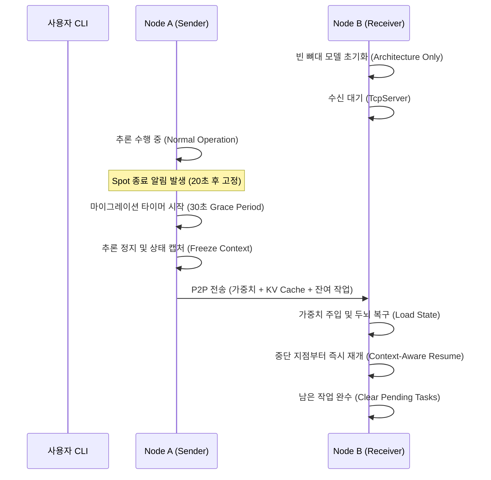

# SpotServe 기반 P2P 마이그레이션 PoC

SpotServe의 핵심 메커니즘인 **P2P 소켓 통신을 통한 상태 전송**을 구현한 PoC 시스템입니다. `facebook/opt-125m` 모델을 사용하여 Node A에서 Node B로 추론 상태(가중치 + KV Cache + 남은 작업)를 유실 없이 이전합니다.

## 1. 마이그레이션 프로세스 아키텍처

SpotServe의 'Stop-and-Copy' 전략을 기반으로 구현된 마이그레이션 워크플로우입니다.



## 2. 구성 파일 정보

- [migration_utils.py](./migration_utils.py): SpotServe의 `TcpAgent` 구조를 참고하여 Python으로 재구현하고, 대용량 객체(`torch.save` 기반) 송수신 기능을 추가한 통신 모듈.
- [opt_engine.py](./opt_engine.py): `transformers` 기반의 OPT 모델 추론 엔진으로, 토큰 단위의 **KV Cache 추출/주입** 로직이 포함됨.
- [node_a.py](./node_a.py) (Sender): 추론 중 설정된 시간(20초) 후에 발생하는 종료 알림에 대응하여 30초 내에 모든 상태를 전송.
- [node_b.py](./node_b.py) (Receiver): **학습된 가중치 없이 모델 구조(Architecture)만 초기화하여 시작**하며, A로부터 성공적으로 전송받아야만 정상적인 추론이 가능해짐 (P2P 의존성 검증).

## 3. 환경 설정 (가상 환경 권장)

```bash
python3 -m venv venv
source venv/bin/activate
pip install -r requirements.txt
```

## 4. 실행 방법 (로컬)

마이그레이션 효과를 확인하기 위해 두 개의 터미널을 사용합니다.

### 4.1 기본 실행 (SpotServe P2P 방식)

가장 권장되는 모드로, 모든 상태(가중치 + KV Cache)를 전송합니다.

1. **Terminal 1 (Node B / Receiver)**:
   ```bash
   # GPU 사용 시 --device cuda 옵션 추가
   python node_b.py --port 10051 --device cpu
   ```
2. **Terminal 2 (Node A / Sender)**:
   ```bash
   # 로컬에서 동일 머신 테스트 시 127.0.0.1 사용
   python node_a.py --dest_ip 127.0.0.1 --port 10051 --device cpu
   ```

- 실행 후 **20초** 시점에 결정론적으로 Spot 종료 알림이 발생합니다.
- 재현성을 위해 랜덤 시드(`seed=42`)가 고착되어 있어, 매 실행마다 동일한 시점에 마이그레이션이 발생합니다.
- Node A는 즉시 추론을 중단하고 마이그레이션을 시작하며, 30초 내에 완료 여부를 체크합니다.
- Node B는 A가 멈춘 지점부터 문장을 정확히 이어가는지 확인합니다.

---

### 4.2 AWS 배포 및 주의사항 (EC2 g4dn)

AWS 환경에서 두 대의 인스턴스로 실습할 경우 아래 설정을 확인하세요.

- **보안 그룹**: Node A와 Node B가 **동일한 보안 그룹(Security Group)**을 사용하도록 설정하고, 수신(Inbound) 규칙에서 `TCP 10051` 포트를 허용합니다.
- **네트워크**: 데이터 전송 비용 절감과 고속 통신을 위해 `--dest_ip`에는 Node B의 **Private IP** 주소를 입력하세요.
- **하드웨어 권장 사양**:
  - **GPU**: CUDA 지원 NVIDIA GPU (모델 추론 및 텐서 연산용)
  - **RAM**: 8GB 이상의 여유 공간 (텐서 직렬화 및 전송 버퍼 고려)
  - **SSD**: 50GB 이상 (gp3 권장)

---

## 5. 비교 실험: SpotServe vs Naive Cold-Start

이 PoC는 SpotServe의 P2P 상태 전송이 일반적인 방식(새 노드에서 모델 재로딩)보다 얼마나 효율적인지 측정할 수 있는 비교 모드를 제공합니다.

### 5.1 실험 환경 및 구현 세부 사항

실제 성능 측정을 위해 다음과 같은 환경에서 테스트를 진행했습니다.

- **인프라**: AWS EC2 `g4dn.xlarge` (NVIDIA T4 GPU) x 2대
- **모델**: `facebook/opt-125m`
- **워크로드**:
  - 총 프롬프트: 1,200개 (Batch Size 100 x 12번 추론)
  - 입력 토큰: 20 tokens / 최대 생성 토큰: 200 tokens
- **핵심 구현 (SpotServe Mechanism 기반)**:
  - **P2P State Transfer (TCP over NCCL)**: SpotServe의 P2P 전송 철학을 따르되, 원본의 C++ NCCL 기반 고속 통신 대신 **Python `socket` & `torch.save`**를 사용하여 범용적인 TCP 통신 레이어로 재구성했습니다.
    ```python
    # PoC 구현 방식 (migration_utils.py)
    self.conn.sendall(struct.pack('Q', len(data))) # 데이터 크기 전송
    self.conn.sendall(data) # Weight + KV Cache 바이트 전송
    ```
  - **Token-level State Committing**: 요청(Request) 단위가 아닌 **토큰 생성 단위**로 KV Cache를 관리합니다. 이는 Preemption 발생 시 연산 손실을 최소화하는 SpotServe의 핵심 로직을 모방한 것입니다.
    ```python
    # 매 토큰 스텝마다 중단 신호 감시 및 상태 반환 (opt_engine.py)
    for i in range(max_new_tokens):
        if callback(): return {"past_key_values": pkv, "step": i} 
        out, pkv = model(input_ids, past_key_values=pkv)
    ```
  - **Architecture-only Initialization**: 데이터 수신 노드(Node B)는 가중치 없이 **모델 구조(Config)만 로드한 상태**로 시작하여, SpotServe의 동적 상태 주입(State Injection) 의존성을 검증합니다.

### 5.2 상세 지표 및 결과 분석 (Latency Results)

다음은 실제 `g4dn.xlarge` 환경에서 측정된 비교 결과입니다.

#### [CASE 1] SpotServe Mode (P2P State Injection)

```text
============================================================
📊 [Node B] DETAILED MIGRATION REPORT (Mode: SPOTSERVE)
------------------------------------------------------------
1. Network Transfer Time   : 100.42 seconds
2. P2P Weight Injection    : 0.0050 seconds (Memory Copy Only)
3. Resumed Batch Inference : 0.53 seconds (KV Cache used)
4. Remaining Tasks Processing: 24.43 seconds
------------------------------------------------------------
✅ Total Prompts Completed     : 1200
============================================================
```

#### [CASE 2] Naive Mode (Cold Start)

```text
============================================================
📊 [Node B] DETAILED MIGRATION REPORT (Mode: NAIVE)
------------------------------------------------------------
1. Network Transfer Time   : 0.00 seconds
2. Cold Boot Overhead      : 2.06 seconds (Disk I/O + Init)
3. Restarted Batch Inference: 2.60 seconds (Re-computed from start)
4. Remaining Tasks Processing: 25.10 seconds
------------------------------------------------------------
✅ Total Prompts Completed     : 1200
============================================================
```

### 5.3 결과 해석 및 시사점

1. **Network Transfer Time (100.42s)**: 동일 AZ 내의 소형 모델임에도 소켓 통신 오버헤드로 인해 약 1분 40초가 소요되었습니다. 이는 향후 **NCCL 기반의 고속 전송** 및 클러스터링 최적화가 필수적임을 시사합니다.
2. **Cold Boot Overhead (2.06s)**: 로컬 캐시를 사용한 모델 로딩 시간입니다. 모델 규모가 커질수록 이 수치는 기하급수적으로 증가하며 SpotServe의 P2P 방식이 더 유리해집니다.
3. **Inference 재개 효율 (약 2.0s 단축)**: KV Cache를 유지한 채 재개했을 때(`0.53s`)와 처음부터 다시 계산했을 때(`2.60s`)를 비교하면, 짧은 유예 기간(Grace Period) 내에 서비스를 복구하는 데 있어 KV Cache 이전이 매우 유의미함을 확인할 수 있습니다.

---
